# はじめに
以前[「Rではじめる地理空間データの統計解析入門」を衛星データを使って実践](https://qiita.com/chicken_data_analyst/items/6a8a6491fd0c4d12e665)という記事を書いた。  
ラスターデータである衛星データを行政区分のベクターデータを使ってベクターデータ化して空間統計にちょっと触れてみるという内容だった。  
参考にした[「Rではじめる地理空間データの統計解析入門」](https://www.kspub.co.jp/book/detail/5273036.html)はRで解析する本なので、記事を書いた時もRで実践した。  
[「Rではじめる地理空間データの統計解析入門」](https://www.kspub.co.jp/book/detail/5273036.html)はめちゃくちゃ良い本だが、普段はPython使いなので、Pythonでもラスターデータやベクターデータを使って分析できるようになりたいなとは思っていて、そのうち勉強するかーと思っていた時に神の本を見つけた…。  
  
**[「Pythonで学ぶ衛星データ解析基礎 環境変化を定量的に把握しよう」](https://gihyo.jp/book/2022/978-4-297-13232-3)**
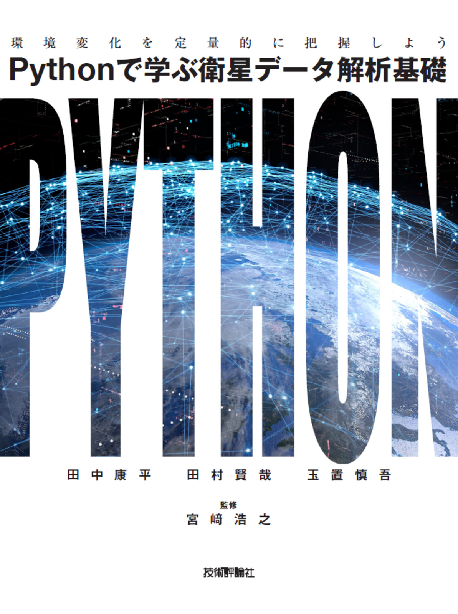
  
衛星データの取得方法から、ラスターデータ/ベクターデータのハンドリング方法、可視化方法、機械学習による回帰/分類の方法まで載っていてかなり広く衛星データ分析について学ぶことができる神本。  
空間統計（モランI統計量とかバリオグラムとか）についてはあまり触れられていないが、一般的な機械学習モデルによる空間予測については載っている。こういうのが欲しかったんだよ！  
  
というわけで今回は、[「Pythonで学ぶ衛星データ解析基礎 環境変化を定量的に把握しよう」](https://gihyo.jp/book/2022/978-4-297-13232-3)やその他情報を参考にしながら、筆者自身に縁があり、また近年、地価上昇率でTopにもなった[茨城県つくばみらい市](https://www.nikkansports.com/general/nikkan/news/202210040000048.html)について衛星データによるバンド演算結果可視化やモランI統計量の計算などを実施していく。  
やることを分けると以下の順で7つある。
1. 衛星データダウンロード
2. 小地域の境界データダウンロード
3. 衛星データの前処理
4. バンド演算
5. クラスタリング
6. 特定クラスタ領域の面積計算
7. ベクターデータ化してモランI統計量計算

バンド演算で得た指標の2018年と2023年の差を取ることで、変化があった場所の可視化や、差の大きさをもとにクラスタリングして変化が大きかったクラスタ領域の面積などを求める、といったことをやった。  
あとPythonによる空間統計量の導出もやってみたかったので、最後にバンド演算で得た指標のラスタデータをベクターデータ化して、局所モランI統計量を求めて可視化などを実施した感じ。（なので5,6章と7章はつながりはない。）

# 参考
- [[書籍]Pythonで学ぶ衛星データ解析基礎 環境変化を定量的に把握しよう](https://gihyo.jp/book/2022/978-4-297-13232-3)
- [[書籍]Rではじめる地理空間データの統計解析入門](https://www.kspub.co.jp/book/detail/5273036.html)
- [[Github]Pythonで学ぶ衛星データ解析基礎 環境変化を定量的に把握しよう](https://github.com/tamanome/satelliteBook/tree/main/notebooks)
- [Rasterio公式](https://rasterio.readthedocs.io/en/stable/)
- [GeoPandas公式](https://geopandas.org/en/stable/)
- [rasterstats公式](https://pythonhosted.org/rasterstats/)
- [EarthPy公式](https://earthpy.readthedocs.io/en/latest/)
- [Shapely公式](https://shapely.readthedocs.io/en/stable/manual.html)
- [PySAL公式](https://pysal.org/)
- [libpysal公式](https://pysal.org/libpysal/)
- [Raster Resampling for Discrete and Continuous Data](https://gisgeography.com/raster-resampling/)
- [Copernicus Browser（Sentinel衛星のデータをダウンロードできる）](https://browser.dataspace.copernicus.eu/)
- [GISデータ一覧　行政区域データ](https://note.sngklab.jp/?p=301)
- [境界データ（市町村）：国土数値情報ダウンロードサイト](https://nlftp.mlit.go.jp/ksj/gml/datalist/KsjTmplt-N03-2024.html)
- [境界データ（小地域（町丁・字等別））：e-Stat](https://www.e-stat.go.jp/gis/statmap-search?page=1&type=2&aggregateUnitForBoundary=A&toukeiCode=00200521&toukeiYear=2020&serveyId=A002005212020&coordsys=1&format=shape&datum=2011)
- [課題に応じて変幻自在？ 衛星データをブレンドして見えるモノ・コト #マンガでわかる衛星データ](https://sorabatake.jp/5192/)
- [衛星スペクトル指標を用いた都市化の画像解析 ](https://www.cit.nihon-u.ac.jp/kouendata/No.39/3_doboku/3-024.pdf)
- [森林分野における衛星データ利用事例](https://tellusxdp.github.io/start-python-with-tellus/tellus_forest.html)
- [漁業での衛星データ利用事例](https://tellusxdp.github.io/start-python-with-tellus/tellus_fishery.html)
- [Sentinel-2 Imagery: NDVI Raw](https://www.arcgis.com/home/item.html?id=1e5fe250cdb8444c9d8b16bb14bd1140)
- [Sentinel-2 Imagery: Normalized Difference Built-Up Index (NDBI)](https://www.arcgis.com/home/item.html?id=3cf4e98f035e47279091dc74d43392a5)
- [esrij ジャパン GIS 基礎解説 リサンプリング](https://www.esrij.com/gis-guide/imagery/resampling/)
- [つくばみらい市のホームページ](https://www.city.tsukubamirai.lg.jp/page/page002206.html)

# 環境
使用環境はGoogle Colaboratory。  
以下のパッケージをpipでインストールする。（使っていないやつもあるけど…。）  
ラスタデータのハンドリングは基本的に`rasterio`で実施し、ベクターデータのハンドリングは`geopandas`で実施した。  
RGB画像は`rioxarray`でラスタデータをまとめた上で作成。  
空間統計量は`pysal`と`libpysal`で計算できる。  
```python
!pip install geopandas
!pip install earthpy
!pip install rasterio
!pip install sentinelsat
!pip install cartopy
!pip install fiona
!pip install shapely
!pip install pyproj
!pip install pygeos
!pip install rtree
!pip install rioxarray
!pip install pystac-client sat-search
!pip install rich
!pip install rasterstats
!pip install pysal
!pip install libpysal
```

Google Driveをマウントしておく。
```python
from google.colab import drive
drive.mount('/content/drive')
```

# 衛星データダウンロード
今回必要なパッケージをインポートしておく。
```python
#必要ライブラリのインポート
import numpy as np
from scipy.ndimage import gaussian_filter
import pandas as pd
import matplotlib
import matplotlib.pyplot as plt
import matplotlib.image as mpimg
import matplotlib.ticker as ptick
import matplotlib.font_manager as fm
from matplotlib.colors import BoundaryNorm
from matplotlib.cm import get_cmap
import mpl_toolkits
from mpl_toolkits.axes_grid1 import make_axes_locatable
import sklearn
import sklearn.cluster
import sklearn.metrics
from sklearn import preprocessing
import rich.table
import xarray as xr
import rioxarray as rxr

import geopandas as gpd
import cartopy, fiona, shapely, pyproj, rtree, pygeos
import cv2
import rasterio as rio
from rasterio import plot
from rasterio.plot import show, plotting_extent
from rasterio.mask import mask
from rasterio.enums import Resampling
from rasterio.features import geometry_mask, shapes
from shapely.geometry import MultiPolygon, Polygon, shape
import rasterstats
import earthpy.spatial as es
import earthpy.plot as ep
import libpysal
from pysal.lib import weights
from pysal.explore import esda
from pysal.viz import splot
from splot.esda import plot_moran, plot_local_autocorrelation

import os
import zipfile
import glob
import shutil

import urllib
from satsearch import Search
from pystac_client import Client
from PIL import Image
import requests
import io
from pystac_client import Client
import warnings

# 日本語フォント読み込み
jpn_fonts=list(np.sort([ttf for ttf in fm.findSystemFonts() if 'ipaexg' in ttf or 'msgothic' in ttf or 'japan' in ttf or 'ipafont' in ttf]))
jpn_font=jpn_fonts[0]
prop = fm.FontProperties(fname=jpn_font)
print(jpn_font)
plt.rcParams['font.family'] = prop.get_name() #全体のフォントを設定
```
<br>
まずは衛星データをダウンロードする。
これは書籍[「Pythonで学ぶ衛星データ解析基礎 環境変化を定量的に把握しよう」](https://gihyo.jp/book/2022/978-4-297-13232-3)のコードを拝借。（[書籍の著者のNotebook](https://github.com/tamanome/satelliteBook/blob/main/notebooks/04_ch4-1BandCalc.ipynb)）
<br>
<br>

取得したい緯度経度の範囲と時間範囲を茨城県を含む範囲で定義。
```python
# 取得範囲を指定するための関数を定義
def selSquare(lon, lat, delta_lon, delta_lat):
    c1 = [lon + delta_lon, lat + delta_lat]
    c2 = [lon + delta_lon, lat - delta_lat]
    c3 = [lon - delta_lon, lat - delta_lat]
    c4 = [lon - delta_lon, lat + delta_lat]
    geometry = {"type": "Polygon", "coordinates": [[ c1, c2, c3, c4, c1 ]]}
    return geometry

# 茨城県周辺の緯度経度をbbox内へ
geometry = selSquare(140.0363, 35.9632, 0.06, 0.02)
timeRange = '2018-01-01/2023-12-31' # 取得時間範囲を指定
```
<br>

STAC ([SpatioTemporal Asset Catalogs: STAC](https://stacspec.org/en/)) サーバーに接続し、定義した緯度経度の範囲と時間範囲のデータを取ってくる。
```python
# データをダウンロードするかどうか
DOWNLOAD = True
```
```python
# STACサーバに接続し、取得範囲・時期やクエリを与えて取得するデータを絞る
# sentinel:valid_cloud_coverを用いて、雲量の予測をより確からしいもののみに限定している
if DOWNLOAD:
  api_url = 'https://earth-search.aws.element84.com/v0'
  collection = "sentinel-s2-l2a-cogs"  # Sentinel-2, Level 2A (BOA)
  s2STAC = Client.open(api_url, headers=[])
  s2STAC.add_conforms_to("ITEM_SEARCH")

  s2Search = s2STAC.search (
      intersects = geometry,
      datetime = timeRange,
      query = {"eo:cloud_cover": {"lt": 11}, "sentinel:valid_cloud_cover": {"eq": True}},
      collections = collection)

  s2_items = [i.to_dict() for i in s2Search.get_items()]
  print(f"{len(s2_items)} のシーンを取得")
# >> 227 のシーンを取得
```
<br>

取得したシーンの情報をデータフレームにまとめる。
```python
# product_idやそのgeometryの情報がまとまったdf作成
if DOWNLOAD:
  items = s2Search.get_all_items()
  df = gpd.GeoDataFrame.from_features(items.to_dict(), crs="epsg:32654")
  dfSorted = df.sort_values('eo:cloud_cover').reset_index(drop=True)
  # epsgの種類
  print('epsg', dfSorted['proj:epsg'].unique())
  display(dfSorted.head(3))
  # 雲量10以下の日時
  print(np.sort(dfSorted[dfSorted['eo:cloud_cover']<=10]['datetime'].unique()))
```
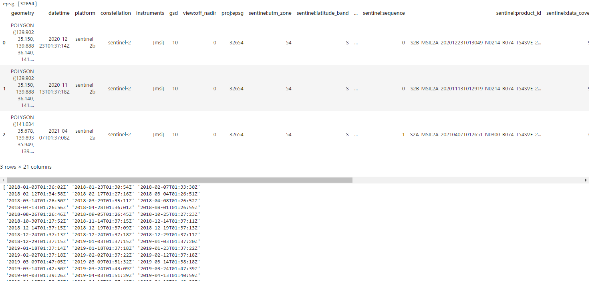  
<br>

取り出したい日時のproduct_id一覧を出す。今回は4月末から5月初めの時期から選んだ。2018年は同じ日時で2つシーンがあったので1つを選んだ。
```python
# 2018‐2023各年の同じ時期のproduct_id一覧取得
if DOWNLOAD:
  df_selected = dfSorted[dfSorted['datetime'].isin(['2018-04-28T01:36:01Z', '2019-05-08T01:37:21Z', '2020-05-02T01:37:21Z', '2021-04-22T01:37:12Z', '2022-04-12T01:37:20Z', '2023-04-27T01:37:18Z'])].copy().sort_values('datetime').iloc[[0,2,3,4,5,6],:]
  display(df_selected['sentinel:product_id'].to_list())
```
  
<br>

各シーンのデータがあるURLやtifファイル名の一覧を取得する。
```python
# 各productのデータURLやtifファイル名の一覧取得
if DOWNLOAD:
  selected_item = [x.assets for x in items if x.properties['sentinel:product_id'] in (df_selected['sentinel:product_id'].to_list())]
  selected_item = sorted(selected_item, key=lambda x:x['thumbnail'].href)
```
<br>

選んだデータが狙い通りの場所なのか、雲は少ないかなどを確認するためにサムネイル画像を可視化して見ておく。
```python
# thumbnailで撮影領域確認
if DOWNLOAD:
  fig = plt.figure(figsize=(7,3))
  for ix, sitm in enumerate(selected_item):
    thumbImg = Image.open(io.BytesIO(requests.get(sitm['thumbnail'].href).content))
    ax = plt.subplot(2,3,ix+1)
    ax.imshow(thumbImg)
    plt.setp(ax.get_xticklabels(), fontsize=4)
    plt.setp(ax.get_yticklabels(), fontsize=4)
    ax.set_title('撮影日時 : '+'-'.join(sitm['thumbnail'].href.split('/')[-5:-2]), fontsize=4)
plt.tight_layout()
plt.show()
```
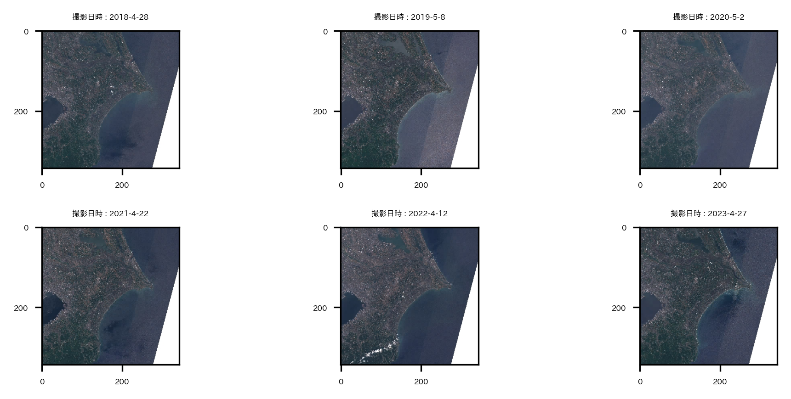  
<br>

Sentinel-2のバンド情報を確認しておく。  
バンド2,3,4でRGB画像が作ることができる。バンド8と4で正規化植生指数NDVIが計算できる。バンド11と8で正規化都市化指数NDBIが計算できる。
```python
# Sentinel-2のバンド情報を表で示す
if DOWNLOAD:
  table = rich.table.Table("Asset Key", "Description")
  for asset_key, asset in selected_item[0].items():
    table.add_row(asset_key, asset.title)

  display(table)
```
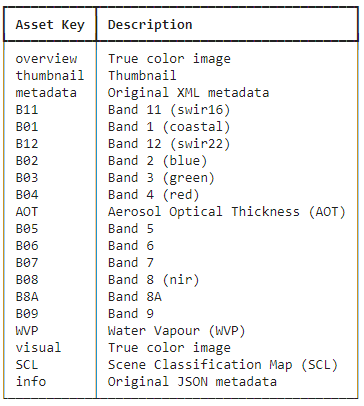  
<br>

tifファイルをダウンロードする関数を定義し、実際にバンド11,8,4,3,2のデータをダウンロードする。（結構時間がかかった。）
```python
# URLからファイルをダウンロードする関数を定義
# 引用：https://note.nkmk.me/python-download-web-images/
def download_file(url, dst_path):
    try:
        with urllib.request.urlopen(url) as web_file, open(dst_path, 'wb') as local_file:
            local_file.write(web_file.read())
    except urllib.error.URLError as e:
        print(e)

def download_file_to_dir(url, dst_dir):
    download_file(url, os.path.join(dst_dir, url.split('/')[-2]+'_'+os.path.basename(url)))

# 画像を保存するディレクトリの作成
dst_dir = 'content/drive/MyDrive/satelite/s2Bands'  # Google Colabでは'/content~~'が正
os.makedirs(dst_dir, exist_ok=True)
# tifファイルをダウンロード(時間かかる)
if DOWNLOAD:
  # 取得するバンドの選択
  bandLists = ['B11','B08','B04','B03','B02'] # SWIR, NIR, RED, GREEN, BLUE

  # 画像のURL取得
  file_url = []
  for sitm in selected_item:
    [file_url.append(sitm[band].href) for band in bandLists if file_url.append(sitm[band].href) is not None]

  # 画像のダウンロード
  [download_file_to_dir(link, dst_dir) for link in file_url if download_file_to_dir(link, dst_dir) is not None]

# ダウンロードファイルリスト（撮影日時順）
display(sorted(os.listdir(dst_dir), key=lambda x:(x.split('_54SVE_')[-1])))
```
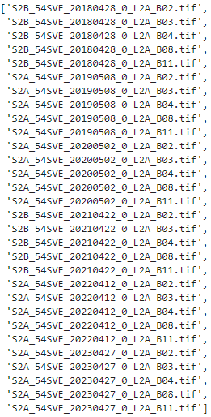  
<br>

ダウンロードが完了したら、試しにバンド11のデータを1つ可視化してみる。
```python
# 試しにバンド11のデータを1つ可視化
src = rio.open(os.path.join(dst_dir,'S2B_54SVE_20180428_0_L2A_B11.tif'))
fig = plt.figure(figsize=(2, 2))
ax=plt.subplot(1,1,1)
retted = show(src.read(), transform=src.transform, cmap='RdYlGn', ax=ax)
img = retted.get_images()[0]
divider = mpl_toolkits.axes_grid1.make_axes_locatable(ax)
cax = divider.append_axes('right', '5%', pad='3%')
cbar = plt.colorbar(img, cax=cax)
cbar.ax.tick_params(labelsize=4)
plt.setp(ax.get_xticklabels(), fontsize=4)
plt.setp(ax.get_yticklabels(), fontsize=4)
ax.yaxis.offsetText.set_fontsize(4)
ax.yaxis.set_major_formatter(ptick.ScalarFormatter(useMathText=True))
ax.ticklabel_format(style='sci', axis='y', scilimits=(0,0))
plt.show()
```
いい感じ。
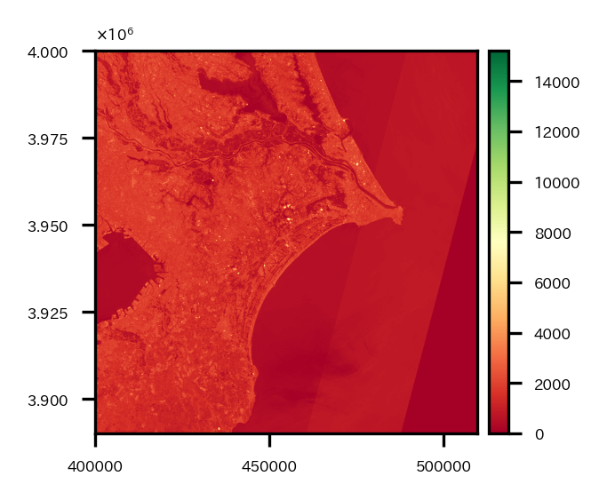

# 小地域の境界データダウンロード
つくばみらい市の小地域の境界データを[e-Stat](https://www.e-stat.go.jp/gis/statmap-search?page=2&type=2&aggregateUnitForBoundary=A&toukeiCode=00200521&toukeiYear=2020&serveyId=A002005212020&prefCode=08&coordsys=2&format=shape&datum=2011)からダウンロードして分析環境に置く（使用するファイル名は"r2ka08235.shp"）。  
ベクターデータである境界データの座標系を、ダウンロードしたSentinel-2と同じ座標系に変換する。もともとの境界データの座標系は投影座標系である平面直角座標系のEPSG:6677だが、Sentinel-2のデータは投影座標系であるUTM座標系のEPSG:32654なので、境界データの座標系をEPSG:32654に変換する。  
また、今回使う境界データは同じ小地域がさらに細かく分かれている場合があるので、小地域単位でグループ化しておく。結果レコード数が106から98になる。
```python
# 座標の基準とするラスターデータ読み込み
raster_crs = rio.open(os.path.join(dst_dir,'S2B_54SVE_20180428_0_L2A_B11.tif'))
raster_profile = raster_crs.profile

# 小地域区分のベクターデータ（from e-Stat）を読み込みcrsをラスターデータに合わせる
shape_path = "content/drive/MyDrive/satelite/ibrakiPolygon/"  # Google Colabでは'/content~~'が正
os.makedirs(shape_path, exist_ok=True)
part_in_shape = gpd.read_file(os.path.join(shape_path, "r2ka08235.shp"), encoding="shift-jis")[['PREF_NAME', 'CITY_NAME', 'S_NAME', 'AREA', 'PERIMETER', 'JINKO', 'SETAI', 'geometry']]
re_shape_tsukuba_mirai_2RasterCrs = part_in_shape.to_crs(raster_profile["crs"])  #crs合わせ
print(re_shape_tsukuba_mirai_2RasterCrs.shape)
# 同じ小地域がさらに細かく分かれている場合があるので、小地域単位でグループ化しておく
re_shape_tsukuba_mirai_2RasterCrs = re_shape_tsukuba_mirai_2RasterCrs.dissolve(['PREF_NAME', 'CITY_NAME', 'S_NAME'], aggfunc='sum', as_index=False)
print(re_shape_tsukuba_mirai_2RasterCrs.shape)  # 特定の小地域が統合されレコード数が減る
display(re_shape_tsukuba_mirai_2RasterCrs)
```
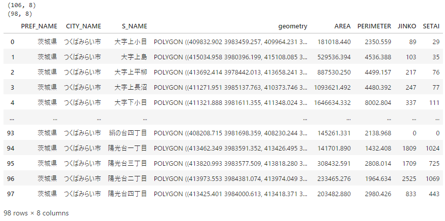  
<br>

試しに境界データを可視化。
```python
# 試しにベクターデータを可視化
fig = plt.figure(figsize=(2, 2))
ax = plt.subplot(1,1,1)
re_shape_tsukuba_mirai_2RasterCrs.plot(facecolor='darkgrey', ax=ax)
plt.setp(ax.get_xticklabels(), fontsize=4)
plt.setp(ax.get_yticklabels(), fontsize=4)
ax.yaxis.offsetText.set_fontsize(4)
ax.yaxis.set_major_formatter(ptick.ScalarFormatter(useMathText=True))
ax.ticklabel_format(style='sci', axis='y', scilimits=(0,0))
plt.show()
```
つくばみらい市が多くのポリゴンで構成されていることがわかる。
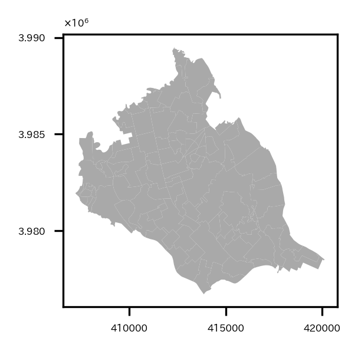

# 衛星データの前処理
衛星データをつくばみらい市の範囲にcropしたり、つくばみらい市のポリゴン外はmaskしたり、分解能の違いにより同じ領域でもピクセル数が異なってしまうデータ同士のグリッドを合わせたり（リサンプリング）など前処理を行う。（ただmaskは一通りバンド演算などした後でするのでこの章ではやっていない…。）  

まずラスタデータのファイルリストを取得する。
```python
# ラスターデータリスト読み込み
getList = sorted(list(glob.glob(dst_dir+'/S2*')), key=lambda x:(x.split('_54SVE_')[-1]))
display(getList)
```
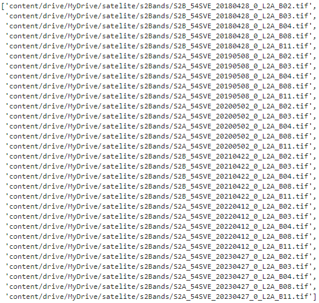
<br>

`earthpy.spatial`の`crop_all`関数を使い、リスト内のラスタデータをすべてつくばみらい市の範囲にcrop処理する。元のファイル名に"_crop"が追加されたファイル名で自動的に保存される。
```python
# ラスターデータをベクターデータの範囲にcropして保存
s2Output = 'content/drive/MyDrive/satelite/s2Output'  # Google Colabでは'/content~~'が正
os.makedirs(s2Output, exist_ok=True) # outputデータ保存ディレクトリ
if DOWNLOAD:
  band_paths_list = es.crop_all(list(getList), s2Output, re_shape_tsukuba_mirai_2RasterCrs, overwrite=True)
# cropしたラスターデータリスト
band_paths_list = sorted(list(glob.glob(s2Output+'/S2*')), key=lambda x:(x.split('_54SVE_')[-1]))  # 撮影日時順にソート
display(band_paths_list)
```
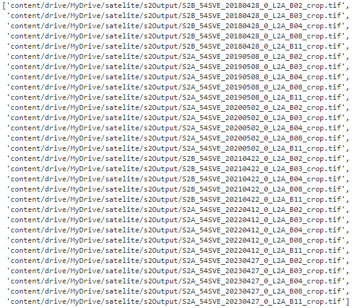  
<br>

試しにバンド8のデータを境界データと共に可視化してみる。
```python
# cropしたラスターデータ（つくばみらい市）をベクターデータと共に試しに可視化
src = rio.open(band_paths_list[3])  # Band 8
fig = plt.figure(figsize=(2, 2))
ax=plt.subplot(1,1,1)
retted = show(src.read(), transform=src.transform, cmap='coolwarm', ax=ax, vmin=0, vmax=3500)
im = retted.get_images()[0]
divider = mpl_toolkits.axes_grid1.make_axes_locatable(ax)
cax = divider.append_axes("right", '5%')
cbar = fig.colorbar(im, ax=ax, cax=cax, shrink=0.6, extend='both')
cbar.ax.tick_params(labelsize=4)
re_shape_tsukuba_mirai_2RasterCrs.plot(facecolor='none', edgecolor='k', alpha=1, ax=ax, linewidth=0.2)
plt.setp(ax.get_xticklabels(), fontsize=4)
plt.setp(ax.get_yticklabels(), fontsize=4)
ax.yaxis.offsetText.set_fontsize(4)
ax.yaxis.set_major_formatter(ptick.ScalarFormatter(useMathText=True))
ax.ticklabel_format(style='sci', axis='y', scilimits=(0,0))
ax.set_title('_'.join(os.path.basename(src.name).split('_')[-5:-1]), fontsize=4)
plt.tight_layout()
plt.show()
```
つくばみらい市の範囲にcropされていることが確認できる。
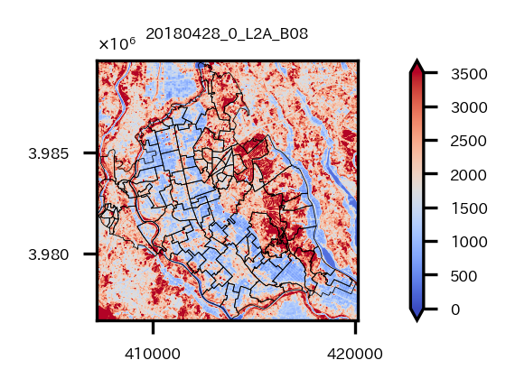
<br>

バンド11は20m分解能だが、他のバンド2,3,4,8は10m分解能なので、同じ範囲でcropしてもピクセル数が異なっている。このままだとデータ同士の四則演算など計算ができないため、バンド2,3,4,8をリサンプリングし、バンド11にグリッドを合わせる作業をする。  
  
各バンドのcropしたデータのリストを取得。
```python
# 各バンドのtifファイルのリスト
B04s = sorted(list(glob.glob(os.path.join(s2Output,'S2*B04_crop.tif*'))), key=lambda x:(x.split('_54SVE_')[-1]))
B08s = sorted(list(glob.glob(os.path.join(s2Output,'S2*B08_crop.tif*'))), key=lambda x:(x.split('_54SVE_')[-1]))
B11s = sorted(list(glob.glob(os.path.join(s2Output,'S2*B11_crop.tif*'))), key=lambda x:(x.split('_54SVE_')[-1]))

B03s = sorted(list(glob.glob(os.path.join(s2Output,'S2*B03_crop.tif*'))), key=lambda x:(x.split('_54SVE_')[-1]))
B02s = sorted(list(glob.glob(os.path.join(s2Output,'S2*B02_crop.tif*'))), key=lambda x:(x.split('_54SVE_')[-1]))
print(B04s)
print(B08s)
print(B11s)
print(B03s)
print(B02s)
```
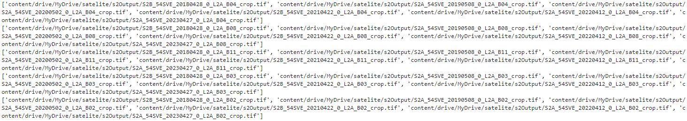  
<br>

リサンプリングを行う。`rasterio.open`で読み込んだファイルに対して`read()`で配列を取り出す際の引数の設定でリサンプリングが可能。  
バンド11のデータの縦のピクセル数、横のピクセル数を引数`out_shape`に設定して、`resampling`でリサンプリング手法を指定したらリサンプリングした配列が返ってくる。（リサンプリング手法：[esrij ジャパン GIS 基礎解説 リサンプリング](https://www.esrij.com/gis-guide/imagery/resampling/)）  
新しいtifファイルとして保存しておく。
```python
# バンドごとに分解能が違う場合があるので、リサンプリングしてグリッドを合わせる
# 10m分解能のバンドを20m分解能のバンド11のグリッドに合わせる
for num, (b04, b08, b11, b03, b02) in enumerate(zip(B04s, B08s, B11s, B03s, B02s)):
  print('#####', os.path.basename(b08).split('_')[2], '#####')
  riod04 = rio.open(b04)
  riod08 = rio.open(b08)
  riod11 = rio.open(b11)
  riod03 = rio.open(b03)
  riod02 = rio.open(b02)
  bounds = riod04.bounds
  # print(riod08.read().shape)
  # print(riod11.read().shape)
  # ラスターデータをリサンプリングしてバンド11に合わせる
  riod08_resampling = riod08.read(out_shape=(riod08.count,int(riod11.height),int(riod11.width)),
                                  resampling=Resampling.cubic)
  riod04_resampling = riod04.read(out_shape=(riod04.count,int(riod11.height),int(riod11.width)),
                                  resampling=Resampling.cubic)
  riod03_resampling = riod03.read(out_shape=(riod03.count,int(riod11.height),int(riod11.width)),
                                  resampling=Resampling.cubic)
  riod02_resampling = riod02.read(out_shape=(riod02.count,int(riod11.height),int(riod11.width)),
                                  resampling=Resampling.cubic)

  print('B11', riod11.read().shape, riod11.read().shape, sep='-->')
  print('B04', riod04.read().shape, riod04_resampling.shape, sep='-->')
  print('B08', riod08.read().shape, riod08_resampling.shape, sep='-->')
  print('B03', riod03.read().shape, riod03_resampling.shape, sep='-->')
  print('B02', riod02.read().shape, riod02_resampling.shape, sep='-->')

  out_meta = riod11.meta
  out_meta.update({'dtype':rio.float32})
    
  fname11 = 'resampling_'+os.path.basename(riod11.name)
  with rio.open(os.path.join(s2Output, fname11), "w", **out_meta) as dest:
    dest.write(riod11.read().astype(rio.float32))

  fname08 = 'resampling_'+os.path.basename(riod08.name)
  with rio.open(os.path.join(s2Output, fname08), "w", **out_meta) as dest:
    dest.write(riod08_resampling.astype(rio.float32))

  fname04 = 'resampling_'+os.path.basename(riod04.name)
  with rio.open(os.path.join(s2Output, fname04), "w", **out_meta) as dest:
    dest.write(riod04_resampling.astype(rio.float32))

  fname03 = 'resampling_'+os.path.basename(riod03.name)
  with rio.open(os.path.join(s2Output, fname03), "w", **out_meta) as dest:
    dest.write(riod03_resampling.astype(rio.float32))

  fname02 = 'resampling_'+os.path.basename(riod02.name)
  with rio.open(os.path.join(s2Output, fname02), "w", **out_meta) as dest:
    dest.write(riod02_resampling.astype(rio.float32))
```
各日時各バンドのピクセル数が半分になったことが確認できる。
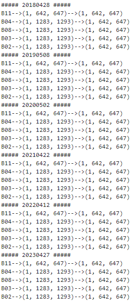  

# バンド演算
つくばみらい市の範囲にcropし、リサンプリングしたので、バンド演算をして、正規化都市化指数：NDBIと正規化植生指数：NDVIを求める。  
NDBIは、
$$
NDBI = \frac{SWIR(Band11)-NIR(Band8)}{SWIR(Band11)+NIR(Band8)}
$$

と計算でき、NDVIは、
$$
NDVI = \frac{NIR(Band8)-RED(Band4)}{NIR(Band8)+RED(Band4)}
$$

と計算できる。  
また、NDBIとNDVIの差分をとり、都市域（BA：built-up area）を抽出するというアプローチもあるそう。
$$
BA = NDBI - NDVI
$$

バンド演算については[「課題に応じて変幻自在？ 衛星データをブレンドして見えるモノ・コト #マンガでわかる衛星データ」](https://sorabatake.jp/5192/)がわかりやすい。  

今回はNDBI、NDVI、BAの3つを演算してつくばみらい市を見ていく。  
まずバンド演算に必要な各バンドのtifファイルのリストを取得。
```python
# 各バンドのtifファイルのリスト
B04s_resampling = sorted(list(glob.glob(os.path.join(s2Output,'resampling_S2*B04_crop.tif*'))), key=lambda x:(x.split('_54SVE_')[-1]))
B08s_resampling = sorted(list(glob.glob(os.path.join(s2Output,'resampling_S2*B08_crop.tif*'))), key=lambda x:(x.split('_54SVE_')[-1]))
B11s_resampling = sorted(list(glob.glob(os.path.join(s2Output,'resampling_S2*B11_crop.tif*'))), key=lambda x:(x.split('_54SVE_')[-1]))

B03s_resampling = sorted(list(glob.glob(os.path.join(s2Output,'resampling_S2*B03_crop.tif*'))), key=lambda x:(x.split('_54SVE_')[-1]))
B02s_resampling = sorted(list(glob.glob(os.path.join(s2Output,'resampling_S2*B02_crop.tif*'))), key=lambda x:(x.split('_54SVE_')[-1]))
print(B04s_resampling)
print(B08s_resampling)
print(B11s_resampling)
print(B03s_resampling)
print(B02s_resampling)
```
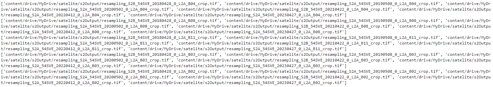

バンド演算を実施し、可視化と演算結果のtifファイル保存を実施。
```python
# NDBI, NDVI, BAを計算し、可視化&TIFファイルとして保存
fig = plt.figure(figsize=(12, 6))
for num, (b04, b08, b11) in enumerate(zip(B04s_resampling, B08s_resampling, B11s_resampling)):
  print('#####', os.path.basename(b08).split('_')[3], '#####')
  riod04_resampling = rio.open(b04).read()
  riod08_resampling = rio.open(b08).read()
  riod11 = rio.open(b11)
  riod11_resampling = riod11.read()
  bounds = riod11.bounds
  print(riod04_resampling.shape)
  print(riod08_resampling.shape)
  print(riod11_resampling.shape)

  # NDBI = SWIR(Band11)-NIR(Band8) / SWIR(Band11)+NIR(Band8)
  # NDVI = NIR(Band8) - RED(Band4) / NIR(Band8) + RED(Band4)
  # BA= NDBIーNDVI
  NDBI = ( riod11_resampling.astype(float) - riod08_resampling.astype(float) ) / ( riod11_resampling.astype(float) + riod08_resampling.astype(float) )
  NDVI = ( riod08_resampling.astype(float) - riod04_resampling.astype(float) ) / ( riod08_resampling.astype(float) + riod04_resampling.astype(float) )
  BA = NDBI - NDVI
  # NDBI可視化
  ax = plt.subplot(3,6,num+1)
  img = ax.imshow(NDBI[0], cmap='coolwarm', vmin=-1, vmax=1, extent=[bounds.left, bounds.right, bounds.bottom, bounds.top])
  plt.setp(ax.get_xticklabels(), fontsize=4)
  plt.setp(ax.get_yticklabels(), fontsize=4)
  divider = mpl_toolkits.axes_grid1.make_axes_locatable(ax)
  cax = divider.append_axes('right', '5%', pad='3%')
  cbar = plt.colorbar(img, cax=cax)
  cbar.ax.tick_params(labelsize=4)
  ax.set_title('NDBI_'+os.path.basename(riod11.name).split('_')[3]+'_'+os.path.basename(riod11.name).split('_')[6], fontsize=4)
  re_shape_tsukuba_mirai_2RasterCrs.plot(facecolor='none', edgecolor='k', alpha=0.5, ax=ax, linewidth=0.5)
  ax.yaxis.offsetText.set_fontsize(4)
  ax.yaxis.set_major_formatter(ptick.ScalarFormatter(useMathText=True))
  ax.ticklabel_format(style='sci', axis='y', scilimits=(0,0))

  # NDVI可視化
  ax = plt.subplot(3,6,num+1+6)
  img = ax.imshow(NDVI[0], cmap='RdYlGn_r', vmin=-1, vmax=1, extent=[bounds.left, bounds.right, bounds.bottom, bounds.top])
  plt.setp(ax.get_xticklabels(), fontsize=4)
  plt.setp(ax.get_yticklabels(), fontsize=4)
  divider = mpl_toolkits.axes_grid1.make_axes_locatable(ax)
  cax = divider.append_axes('right', '5%', pad='3%')
  cbar = plt.colorbar(img, cax=cax)
  cbar.ax.tick_params(labelsize=4)
  ax.set_title('NDVI_'+os.path.basename(riod11.name).split('_')[3]+'_'+os.path.basename(riod11.name).split('_')[6], fontsize=4)
  re_shape_tsukuba_mirai_2RasterCrs.plot(facecolor='none', edgecolor='k', alpha=0.5, ax=ax, linewidth=0.5)
  ax.yaxis.offsetText.set_fontsize(4)
  ax.yaxis.set_major_formatter(ptick.ScalarFormatter(useMathText=True))
  ax.ticklabel_format(style='sci', axis='y', scilimits=(0,0))

  # BA可視化
  ax = plt.subplot(3,6,num+1+12)
  img = ax.imshow(BA[0], cmap='RdBu_r', vmin=-2, vmax=0.4, extent=[bounds.left, bounds.right, bounds.bottom, bounds.top])
  plt.setp(ax.get_xticklabels(), fontsize=4)
  plt.setp(ax.get_yticklabels(), fontsize=4)
  divider = mpl_toolkits.axes_grid1.make_axes_locatable(ax)
  cax = divider.append_axes('right', '5%', pad='3%')
  cbar = plt.colorbar(img, cax=cax)
  cbar.ax.tick_params(labelsize=4)
  ax.set_title('BA_'+os.path.basename(riod11.name).split('_')[3]+'_'+os.path.basename(riod11.name).split('_')[6], fontsize=4)
  re_shape_tsukuba_mirai_2RasterCrs.plot(facecolor='none', edgecolor='k', alpha=0.5, ax=ax, linewidth=0.5)
  ax.yaxis.offsetText.set_fontsize(4)
  ax.yaxis.set_major_formatter(ptick.ScalarFormatter(useMathText=True))
  ax.ticklabel_format(style='sci', axis='y', scilimits=(0,0))

  out_meta = riod11.meta
  out_meta.update({'dtype':rio.float32})
  fname = 'NDBI_'+os.path.basename(riod11.name)
  print(fname)
  with rio.open(os.path.join(s2Output, fname), "w", **out_meta) as dest:
    dest.write(NDBI.astype(rio.float32))

  out_meta = riod11.meta
  out_meta.update({'dtype':rio.float32})
  fname = 'NDVI_'+os.path.basename(riod11.name)
  print(fname)
  with rio.open(os.path.join(s2Output, fname), "w", **out_meta) as dest:
    dest.write(NDVI.astype(rio.float32))

  out_meta = riod11.meta
  out_meta.update({'dtype':rio.float32})
  fname = 'BA_'+os.path.basename(riod11.name)
  print(fname,'\n')
  with rio.open(os.path.join(s2Output, fname), "w", **out_meta) as dest:
    dest.write(BA.astype(rio.float32))

plt.tight_layout()
plt.show()
```
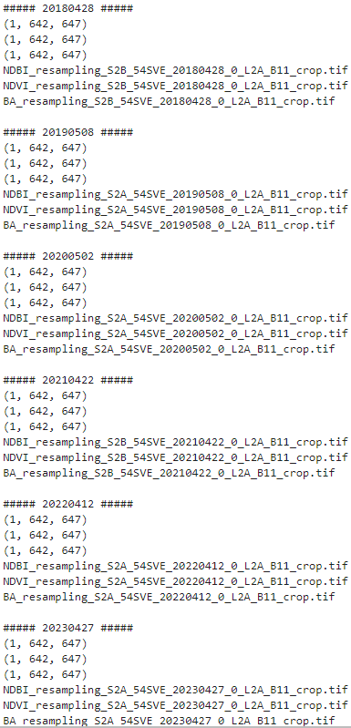  
<br>
上の行からNDBI, NDVI, BA、左の列から2018年～2023年の各年の可視化結果。  
つくばみらい市の中心から東側あたりは、NDVIが高く、NDBIやBAが低いので植物が多く、都市開発は進んでいないと思われる。  
ちょっと不思議なのは、つくばみらい市の中心から西側にかけては基本的に2024年現在も農地なのだが、2021年以降のNDBIはBAが高くなっていて、これはどういうことなのだろうか。時期的に田植えの前か後かで違いでもあるのかしら。わからんな。


つくばみらい市以外の領域をマスクしたtifファイルも作っておく。（これは最後に空間統計量の計算をやってみるときに使う。）  
NDBI, NDVI, BAのtifファイルのリストを読み込んで、
```python
# 各バンドのtifファイルのリスト
ndbi_band_path_list_nomask = sorted(list(glob.glob(os.path.join(s2Output,'NDBI_resampling_S2*.tif*'))), key=lambda x:(x.split('_54SVE_')[-1]))
ndvi_band_path_list_nomask = sorted(list(glob.glob(os.path.join(s2Output,'NDVI_resampling_S2*.tif*'))), key=lambda x:(x.split('_54SVE_')[-1]))
ba_band_path_list_nomask = sorted(list(glob.glob(os.path.join(s2Output,'BA_resampling_S2*.tif*'))), key=lambda x:(x.split('_54SVE_')[-1]))
band_paths_list = ndbi_band_path_list_nomask+ndvi_band_path_list_nomask+ba_band_path_list_nomask
display(band_paths_list)
```
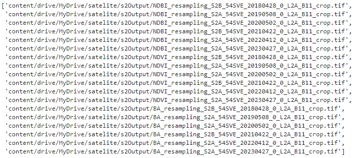  
<br>

各ファイルを読み込んで、マスク処理をしていく。  
マスク処理は`rasterio.mask.mask`を使う。ラスタデータとベクターデータを入れて実行すると、ベクターデータのポリゴン領域外のラスタデータをマスクすることができる。
```python
# ラスタデータのベクターデータのポリゴン範囲外の領域はマスクする処理を実施
# マスク後、ファイルとして保存
# maskの引数をcrop=Trueにしたらcropからmaskまで一気に実施してくれることを後で知った…
fig = plt.figure(figsize=(12, 6))
dim=len(band_paths_list)
for ix, rio_file in enumerate(band_paths_list):
    # ラスターファイルを開く
    with rio.open(rio_file) as src:
      # ラスターデータをベクターデータで切り抜く
      out_image, out_transform = mask(src, re_shape_tsukuba_mirai_2RasterCrs.geometry, crop=True, nodata=np.nan)
      out_meta = src.meta
      name = src.name
      bounds = src.bounds
    
    # メタ情報の更新
    out_meta.update({"driver": "GTiff",
                    "height": out_image.shape[1],
                    "width": out_image.shape[2],
                    "transform": out_transform,
                    'dtype':rio.float32})
    
    # マスク結果可視化
    #ax = plt.subplot(round(np.ceil(dim/np.sqrt(dim))), round(np.ceil(dim/np.sqrt(dim))), ix+1)
    ax = plt.subplot(3, 6, ix+1)

    satIndex = os.path.basename(name).split('_')[0]
    if satIndex=='NDBI':
        cmap = 'coolwarm'
        vmin=-1
        vmax=1
    elif satIndex=='NDVI':
        cmap = 'RdYlGn_r'
        vmin=-1
        vmax=1
    else:
        cmap = 'RdBu_r'
        vmin=-2
        vmax=0.4
    img = ax.imshow(out_image[0], cmap=cmap, vmin=vmin, vmax=vmax, extent=[bounds.left, bounds.right, bounds.bottom, bounds.top])
    plt.setp(ax.get_xticklabels(), fontsize=4)
    plt.setp(ax.get_yticklabels(), fontsize=4)
    divider = mpl_toolkits.axes_grid1.make_axes_locatable(ax)
    cax = divider.append_axes('right', '5%', pad='3%')
    cbar = plt.colorbar(img, cax=cax)
    cbar.ax.tick_params(labelsize=4)
    re_shape_tsukuba_mirai_2RasterCrs.plot(facecolor='none', edgecolor='k', alpha=0.5, ax=ax, linewidth=0.5)
    ax.yaxis.offsetText.set_fontsize(4)
    ax.yaxis.set_major_formatter(ptick.ScalarFormatter(useMathText=True))
    ax.ticklabel_format(style='sci', axis='y', scilimits=(0,0))
    ax.set_title(os.path.basename(name).split('_')[0]+'_'+'_'.join(os.path.basename(name).split('_')[-5:-1]), fontsize=4)
    
    # 画像の書き出し
    with rio.open(os.path.join(os.path.dirname(name), 'masked_'+os.path.basename(name)), "w", **out_meta) as dest:
      dest.write(out_image)
    
plt.tight_layout()
plt.show()
```
つくばみらい市以外の領域がマスクされた。
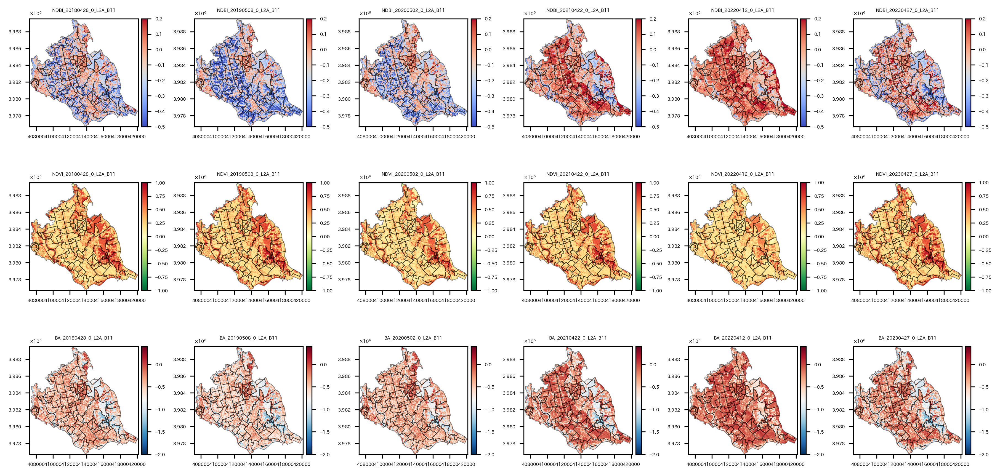
<br>
<br>

さて、ちょっと戻ってマスクする前のNDBI, NDVI, BAのtifファイルのリストを再度読み込んで、
```python
# マスクする前のNDBI, NDVI, BAのTIFファイルリスト
ndbi_band_path_list =sorted(list(glob.glob(os.path.join(s2Output,'NDBI*.tif*'))), key=lambda x: x.split('_54SVE_')[-1])
ndvi_band_path_list =sorted(list(glob.glob(os.path.join(s2Output,'NDVI*.tif*'))), key=lambda x: x.split('_54SVE_')[-1])
ba_band_path_list =sorted(list(glob.glob(os.path.join(s2Output,'BA*.tif*'))), key=lambda x: x.split('_54SVE_')[-1])
display(ndbi_band_path_list)
display(ndvi_band_path_list)
display(ba_band_path_list)
```  
<br>

NDBI, NDVI, BAの最新の日時のファイルと最古の日時のファイル（2023年と2018年）を読み込んで、リストにオブジェクトとして格納する。
```python
# NDBI, NDVI, BAの最新の日時のファイルと最古の日時のファイル（2023と2018）を読み込む
# オブジェクトが格納されたリスト
ndbi_objects = [rio.open(f) for f in ndbi_band_path_list][:][::len(ndbi_band_path_list)-1]
ndvi_objects = [rio.open(f) for f in ndvi_band_path_list][:][::len(ndvi_band_path_list)-1]
ba_objects = [rio.open(f) for f in ba_band_path_list][:][::len(ba_band_path_list)-1]
print(ndbi_objects)
print(ndvi_objects)
print(ba_objects)
```
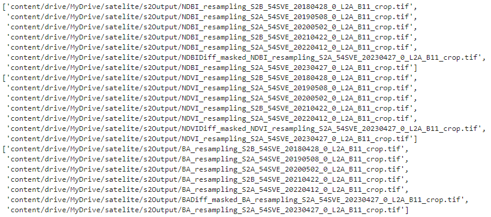
2023年と2018年の各指標のオブジェクトがリストに格納されている。
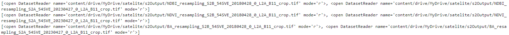  
<br>

そして、NDBI, NDVI, BAの2023年と2018年の差を取って、可視化してtifファイルとして保存する。
```python
# 2023と2018の各指標の差を計算して可視化
fig = plt.figure(figsize=(9, 3))
for i, (dbi, dvi, ba) in enumerate(zip(ndbi_objects, ndvi_objects, ba_objects)):
  if i==0:
    continue
  bounds = ndbi_objects[i].bounds
  diff = ndbi_objects[i].read(1) - ndbi_objects[i-1].read(1)
  ax = plt.subplot(1,3,1)
  img = ax.imshow(diff, cmap='coolwarm', vmin=-1, vmax=1, extent=[bounds.left, bounds.right, bounds.bottom, bounds.top])
  plt.setp(ax.get_xticklabels(), fontsize=4)
  plt.setp(ax.get_yticklabels(), fontsize=4)
  divider = mpl_toolkits.axes_grid1.make_axes_locatable(ax)
  cax = divider.append_axes('right', '5%', pad='3%')
  cbar = plt.colorbar(img, cax=cax)
  cbar.ax.tick_params(labelsize=4)
  ax.set_title(os.path.basename(ndbi_objects[i].name).split('_')[1]+'_'+os.path.basename(ndbi_objects[i].name).split('_')[-5]+' - '+os.path.basename(ndbi_objects[i-1].name).split('_')[-5], fontsize=4)
  re_shape_tsukuba_mirai_2RasterCrs.plot(facecolor='none', edgecolor='k', alpha=0.8, ax=ax, linewidth=0.2)
  ax.yaxis.offsetText.set_fontsize(4)
  ax.yaxis.set_major_formatter(ptick.ScalarFormatter(useMathText=True))
  ax.ticklabel_format(style='sci', axis='y', scilimits=(0,0))

  out_meta = ndbi_objects[i].meta
  out_meta.update({'dtype':rio.float32})
  fname = 'NDBIDiff_'+os.path.basename(ndbi_objects[i].name)
  print(fname)
  with rio.open(os.path.join(s2Output, fname), "w", **out_meta) as dest:
    dest.write(diff.reshape(1,diff.shape[0],diff.shape[1]).astype(rio.float32))

  diff = ndvi_objects[i].read(1) - ndvi_objects[i-1].read(1)
  ax = plt.subplot(1,3,2)
  img = ax.imshow(diff, cmap='RdYlGn_r', vmin=-1, vmax=1, extent=[bounds.left, bounds.right, bounds.bottom, bounds.top])
  plt.setp(ax.get_xticklabels(), fontsize=4)
  plt.setp(ax.get_yticklabels(), fontsize=4)
  divider = mpl_toolkits.axes_grid1.make_axes_locatable(ax)
  cax = divider.append_axes('right', '5%', pad='3%')
  cbar = plt.colorbar(img, cax=cax)
  cbar.ax.tick_params(labelsize=4)
  ax.set_title(os.path.basename(ndvi_objects[i].name).split('_')[1]+'_'+os.path.basename(ndvi_objects[i].name).split('_')[-5]+' - '+os.path.basename(ndvi_objects[i-1].name).split('_')[-5], fontsize=4)
  re_shape_tsukuba_mirai_2RasterCrs.plot(facecolor='none', edgecolor='k', alpha=0.8, ax=ax, linewidth=0.2)
  ax.yaxis.offsetText.set_fontsize(4)
  ax.yaxis.set_major_formatter(ptick.ScalarFormatter(useMathText=True))
  ax.ticklabel_format(style='sci', axis='y', scilimits=(0,0))

  out_meta = ndvi_objects[i].meta
  out_meta.update({'dtype':rio.float32})
  fname = 'NDVIDiff_'+os.path.basename(ndvi_objects[i].name)
  print(fname)
  with rio.open(os.path.join(s2Output, fname), "w", **out_meta) as dest:
    dest.write(diff.reshape(1,diff.shape[0],diff.shape[1]).astype(rio.float32))

  diff = ba_objects[i].read(1) - ba_objects[i-1].read(1)
  ax = plt.subplot(1,3,3)
  img = ax.imshow(diff, cmap='RdBu_r', vmin=-1, vmax=1, extent=[bounds.left, bounds.right, bounds.bottom, bounds.top])
  plt.setp(ax.get_xticklabels(), fontsize=4)
  plt.setp(ax.get_yticklabels(), fontsize=4)
  divider = mpl_toolkits.axes_grid1.make_axes_locatable(ax)
  cax = divider.append_axes('right', '5%', pad='3%')
  cbar = plt.colorbar(img, cax=cax)
  cbar.ax.tick_params(labelsize=4)
  ax.set_title(os.path.basename(ba_objects[i].name).split('_')[1]+'_'+os.path.basename(ba_objects[i].name).split('_')[-5]+' - '+os.path.basename(ba_objects[i-1].name).split('_')[-5], fontsize=4)
  re_shape_tsukuba_mirai_2RasterCrs.plot(facecolor='none', edgecolor='k', alpha=0.8, ax=ax, linewidth=0.2)
  ax.yaxis.offsetText.set_fontsize(4)
  ax.yaxis.set_major_formatter(ptick.ScalarFormatter(useMathText=True))
  ax.ticklabel_format(style='sci', axis='y', scilimits=(0,0))

  out_meta = ba_objects[i].meta
  out_meta.update({'dtype':rio.float32})
  fname = 'BADiff_'+os.path.basename(ba_objects[i].name)
  print(fname)
  with rio.open(os.path.join(s2Output, fname), "w", **out_meta) as dest:
    dest.write(diff.reshape(1,diff.shape[0],diff.shape[1]).astype(rio.float32))
plt.tight_layout()
plt.show()
```
左からNDBI, NDVI, BAの2023年と2018年の差分の可視化。  
中心から半分くらい東側にある領域（[ X：416000, Y：3.983 ]あたり）でNDBI,BAが高く、NDVIが低い領域がある。ここで大きな変化があったようだ。  
次は、このような大きな変化があった領域をクラスタリングで抽出する作業を実施していく。
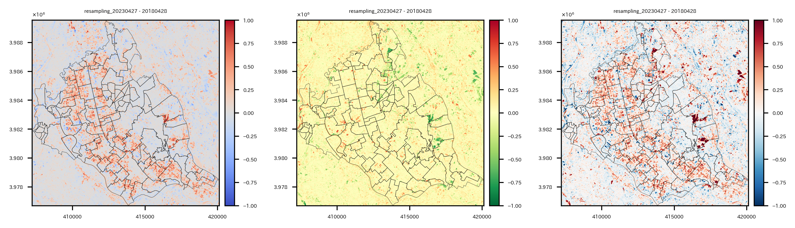

# クラスタリング
クラスタリングの説明変数として、NDBI, NDVI, BAの差分以外に、バンド2,3,4の2023‐2018年差分も使用するので、それらを計算してtifファイルとして保存しておく。
```python
# クラスタリングの説明変数のためにバンド2,3,4の2023‐2018年差分を計算&保存
b02_2018 = rio.open(B02s[0])
b02_2023 = rio.open(B02s[-1])
out_meta = b02_2023.meta
# メタ情報の更新
out_meta.update({"driver": "GTiff",
                "height": b02_2023.read().shape[1],
                "width": b02_2023.read().shape[2],
                "transform": b02_2023.transform})
out_meta.update({'dtype':rio.float32})
b02 = b02_2023.read() - b02_2018.read()
# 画像の書き出し
with rio.open(os.path.join(os.path.dirname(B02s[-1]), 'diff_2023_2018_'+os.path.basename(B02s[-1])), "w", **out_meta) as dest:
  dest.write(b02)

b03_2018 = rio.open(B03s[0])
b03_2023 = rio.open(B03s[-1])
out_meta = b03_2023.meta
# メタ情報の更新
out_meta.update({"driver": "GTiff",
                "height": b03_2023.read().shape[1],
                "width": b03_2023.read().shape[2],
                "transform": b03_2023.transform})
out_meta.update({'dtype':rio.float32})
b03 = b03_2023.read() - b03_2018.read()
# 画像の書き出し
with rio.open(os.path.join(os.path.dirname(B03s[-1]), 'diff_2023_2018_'+os.path.basename(B03s[-1])), "w", **out_meta) as dest:
  dest.write(b03)

b04_2018 = rio.open(B04s[0])
b04_2023 = rio.open(B04s[-1])
out_meta = b04_2023.meta
# メタ情報の更新
out_meta.update({"driver": "GTiff",
                "height": b04_2023.read().shape[1],
                "width": b04_2023.read().shape[2],
                "transform": b04_2023.transform})
out_meta.update({'dtype':rio.float32})
b04 = b04_2023.read() - b04_2018.read()
# 画像の書き出し
with rio.open(os.path.join(os.path.dirname(B04s[-1]), 'diff_2023_2018_'+os.path.basename(B04s[-1])), "w", **out_meta) as dest:
  dest.write(b04)
```  
<br>

バンド2,3,4の2023‐2018年差分をリサンプリングしてNDBIなどのデータとグリッドを合わせておく。
```python
# バンド2,3,4の2023‐2018年差分をリサンプリング
basic_file = rio.open(os.path.join(s2Output, 'BADiff_BA_resampling_S2A_54SVE_20230427_0_L2A_B11_crop.tif')) 
diffBand_list =sorted(list(glob.glob(os.path.join(s2Output,'diff_2023_2018_*.tif*'))), key=lambda x: x.split('_54SVE_')[-1])
for file in diffBand_list:
    tmp = rio.open(file)
    tmp_re = tmp.read(out_shape=(tmp.count,int(basic_file.height),int(basic_file.width)),
                      resampling=Resampling.cubic)
    out_meta = basic_file.meta
    out_meta.update({'dtype':rio.float32})
    
    fname = 'resampling_'+os.path.basename(tmp.name)
    with rio.open(os.path.join(s2Output, fname), "w", **out_meta) as dest:
        dest.write(tmp_re.astype(rio.float32))
```  
<br>

NDBI, NDVI, BAの2023年と2018年の差分とバンド2,3,4の2023‐2018年差分のデータのリストを取得。
```python
# マスクする前のNDBI, NDVI, BAのTIFファイルリスト
diffBand_list =sorted(list(glob.glob(os.path.join(s2Output,'resampling_diff_2023_2018_*.tif*'))), key=lambda x: x.split('_54SVE_')[-1])
diffIndex_list =sorted(list(glob.glob(os.path.join(s2Output,'*Diff_*.tif*'))), key=lambda x: x.split('_54SVE_')[-1])
display(diffBand_list)
display(diffIndex_list)
```
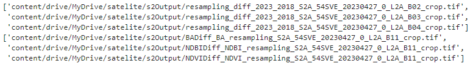  
<br>

読み込んで、グリッドが合っているか確認。
```python
# 読み込みとグリッド確認
b02_diff = rio.open(diffBand_list[0])
b03_diff = rio.open(diffBand_list[1])
b04_diff = rio.open(diffBand_list[2])
ndbi_diff = rio.open(diffIndex_list[1])
ndvi_diff = rio.open(diffIndex_list[2])
ba_diff = rio.open(diffIndex_list[0])
print(b02_diff.read().shape)
print(b03_diff.read().shape)
print(b04_diff.read().shape)
print(ndbi_diff.read().shape)
print(ndvi_diff.read().shape)
print(ba_diff.read().shape)
```
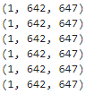

データをそのまま使ってもいいが、ノイズも乗ってそうなので、ガウシアンフィルタでややデータをなましてからクラスタリングをすることにする。  
なますと以下のような感じになる。
```python
# そのままだとノイズも乗っているのである程度なましておく
# ガウシアンフィルタでなました結果の例
fig=plt.figure(figsize=(4,2))
ax = plt.subplot(1,2,1)
ax.imshow(b02_diff.read()[0], cmap='viridis', vmin=np.quantile(b02_diff.read()[0], q=0.01), vmax=np.quantile(b02_diff.read()[0], q=0.99))
plt.setp(ax.get_xticklabels(), fontsize=4)
plt.setp(ax.get_yticklabels(), fontsize=4)
ax.set_title('Not Convolved', fontsize=6)
ax = plt.subplot(1,2,2)
ax.imshow(gaussian_filter(b02_diff.read()[0], sigma=3), cmap='viridis', vmin=np.quantile(b02_diff.read()[0], q=0.01), vmax=np.quantile(b02_diff.read()[0], q=0.99))
plt.setp(ax.get_xticklabels(), fontsize=4)
plt.setp(ax.get_yticklabels(), fontsize=4)
ax.set_title('Convolved', fontsize=6)
plt.tight_layout()
plt.show()
```
右側がなました結果。
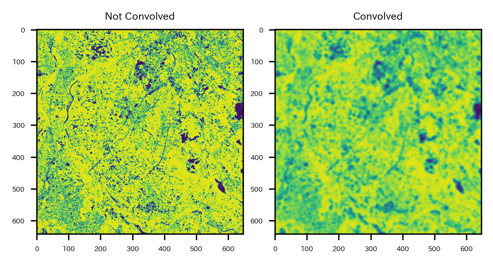
<br>

説明変数として使いたい各データをなまし、1次元化してデータフレームに格納する。  
そしてデータを標準化し、Kmeansでクラスタリングを実施する。今回k=7とした。
```python
# 各バンドや指標をなましてから1次元化し、dfにまとめる
sigma = 3
clusterDf = pd.DataFrame({'b02':gaussian_filter(b02_diff.read()[0], sigma=sigma).ravel(),
                          'b03':gaussian_filter(b03_diff.read()[0], sigma=sigma).ravel(),
                          'b04':gaussian_filter(b04_diff.read()[0], sigma=sigma).ravel(),
                          'NDBI':gaussian_filter(ndbi_diff.read()[0], sigma=sigma).ravel(),
                          'NDVI':gaussian_filter(ndvi_diff.read()[0], sigma=sigma).ravel(),
                          'BA':gaussian_filter(ba_diff.read()[0], sigma=sigma).ravel(),})
# 標準化
ss = preprocessing.StandardScaler()
clusterDf_std = pd.DataFrame(ss.fit_transform(clusterDf), columns=clusterDf.columns)
display(clusterDf_std.head())
# Kmeansでクラスタリング
km_m = sklearn.cluster.KMeans(n_clusters=7, init='k-means++', max_iter=1000, random_state=42)
km_m.fit(clusterDf_std)
cl = km_m.predict(clusterDf_std)
clusterDf['cluster'] = cl
display(clusterDf.head())
```
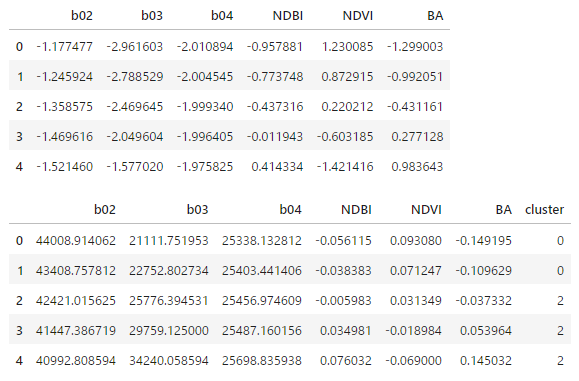
<br>

クラスタリングの結果を1次元からもとの次元数に戻し、tifファイルとして保存。
```python
# クラスタリングの結果を2次元に戻してtifデータとして保存
out_meta = ndbi_diff.meta
# メタ情報の更新
out_meta.update({"driver": "GTiff",
                 "height": ndbi_diff.read().shape[1],
                 "width": ndbi_diff.read().shape[2],
                 "transform": ndbi_diff.transform,
                 'nodata':-1}
               )
# 画像の書き出し
with rio.open(os.path.join(s2Output, 'nomasked_cluster_2023_2018.tif'), "w", **out_meta) as dest:
  dest.write((cl).reshape(ndbi_diff.read().shape))


with rio.open(os.path.join(s2Output, 'nomasked_cluster_2023_2018.tif')) as src:
  # ラスターデータをベクターデータで切り抜く
  out_image, out_transform = mask(src, re_shape_tsukuba_mirai_2RasterCrs.geometry, crop=True, nodata=np.nan)
  out_meta = src.meta
  name = src.name
  bounds = src.bounds

# メタ情報の更新
out_meta.update({"driver": "GTiff",
                "height": out_image.shape[1],
                "width": out_image.shape[2],
                "transform": out_transform,
                'dtype':rio.float32})
# 画像の書き出し
with rio.open(os.path.join(s2Output, 'masked_cluster_2023_2018.tif'), "w", **out_meta) as dest:
  dest.write(out_image)
```  
<br>

クラスタリングの結果を可視化してみる。
```python
# クラスタリングの結果を可視化
masked_cluster_2023_2018 = rio.open(os.path.join(s2Output, 'masked_cluster_2023_2018.tif'))
fig = plt.figure(figsize=(3,3))
ax = plt.subplot(1,1,1)
retted = show(masked_cluster_2023_2018, cmap='tab20c_r', ax=ax)
img = retted.get_images()[0]
plt.setp(ax.get_xticklabels(), fontsize=4)
plt.setp(ax.get_yticklabels(), fontsize=4)
divider = mpl_toolkits.axes_grid1.make_axes_locatable(ax)
cax = divider.append_axes('right', '5%', pad='3%')
cbar = plt.colorbar(img, cax=cax)
cbar.ax.tick_params(labelsize=4)
ax.set_title(os.path.basename(masked_cluster_2023_2018.name), fontsize=4)
re_shape_tsukuba_mirai_2RasterCrs.plot(facecolor='none', edgecolor='k', alpha=0.8, ax=ax, linewidth=0.5)
ax.yaxis.offsetText.set_fontsize(4)
ax.yaxis.set_major_formatter(ptick.ScalarFormatter(useMathText=True))
ax.ticklabel_format(style='sci', axis='y', scilimits=(0,0))
# BAの差分のcontourをプロット
tsukubamirai_20230427_20180428_BADiff = rio.open(diffIndex_list[0])
extent = rio.plot.plotting_extent(tsukubamirai_20230427_20180428_BADiff, tsukubamirai_20230427_20180428_BADiff.profile["transform"])
contour = ax.contour(tsukubamirai_20230427_20180428_BADiff.read(1), [0.8], cmap='Greys_r', linewidths=1, extent=[extent[0],extent[1],extent[3],extent[2]])
contour = ax.contour(tsukubamirai_20230427_20180428_BADiff.read(1), [0.8], cmap='Greys', linewidths=0.5, extent=[extent[0],extent[1],extent[3],extent[2]])
ax.clabel(contour, inline=True, fontsize=4, colors='white')

plt.show()
```
colormapはクラスタリング番号、contourはBAの差分が0.8の部分を表している。2018年～2023年に変化が大きかった領域は濃い青色のクラスタ6の領域であり、BAの差分が0.8の部分とも重なる傾向にある。
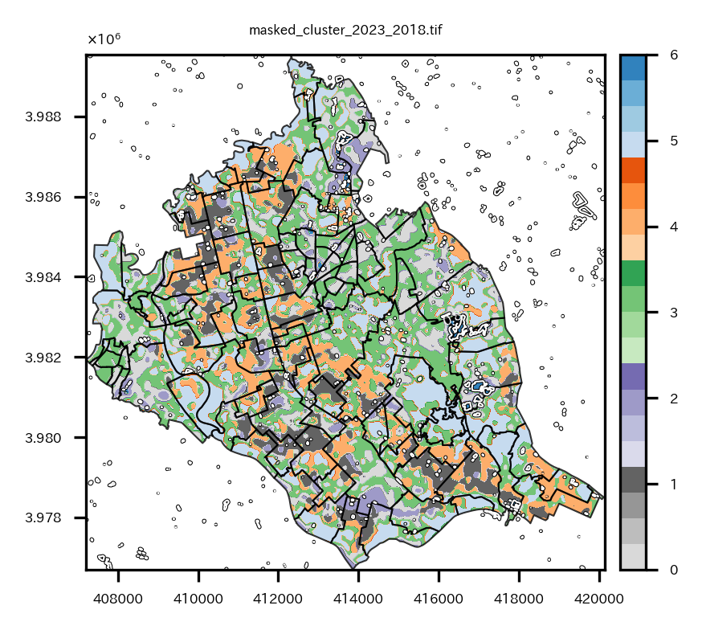
<br>

このクラスタ6の部分にどのような変化があったのか、RGB画像で見てみる。  
これまでの過程で作ったつくばみらい市の領域以外がマスクされたバンド2,3,4のtifデータのリストを取得。
```python
# 各バンドのtifファイルのリスト
B04s_masked = sorted(list(glob.glob(os.path.join(s2Output,'masked_S2*B04_crop.tif*'))), key=lambda x:(x.split('_54SVE_')[-1]))
B03s_masked = sorted(list(glob.glob(os.path.join(s2Output,'masked_S2*B03_crop.tif*'))), key=lambda x:(x.split('_54SVE_')[-1]))
B02s_masked = sorted(list(glob.glob(os.path.join(s2Output,'masked_S2*B02_crop.tif*'))), key=lambda x:(x.split('_54SVE_')[-1]))
print(B04s_masked)
print(B03s_masked)
print(B02s_masked)
```
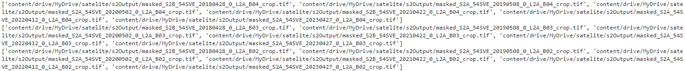  
<br>

バンド2,3,4のデータをxarrayとして読み込んで、リストに格納する。
```python
# 2023年のつくばみらい市のバンド2,3,4のファイル取得
# xarrayとして読み込んでリストに格納
allBands = []
for i, aband in enumerate([B02s_masked[-1], B03s_masked[-1], B04s_masked[-1]]):
    allBands.append(rxr.open_rasterio(aband, masked=True).squeeze())
    # バンド数を新しいxarrayオブジェクトとして割り当てる
    allBands[i]["band"]=i+2

# 2018年のつくばみらい市のバンド2,3,4のファイル取得
# xarrayとして読み込んでリストに格納
allBands_2 = []
for i, aband in enumerate([B02s_masked[0], B03s_masked[0], B04s_masked[0]]):
    allBands_2.append(rxr.open_rasterio(aband, masked=True).squeeze())
    # バンド数を新しいxarrayオブジェクトとして割り当てる
    allBands_2[i]["band"]=i+2
```  
<br>

バンド2,3,4のxarrayを重ねて、`earthpy.plot.plot_rgb`でRGB画像として可視化する。また、そこにクラスタ6の領域のcontourを重ねる。
```python
# 2018, 2023年のつくばみらい市のRGB画像作成(10m分解能のままでOK)
# RGB画像にクラスタ6のcontourを重ねる
fig = plt.figure(figsize=(12,6))

ax = plt.subplot(1,2,1)
# データリストを一つのxarrayオブジェクトへ変換
rgb_arr = xr.concat(allBands_2, dim="band")  # shape=(3, 1283, 1293)

extent = rio.plot.plotting_extent(masked_cluster_2023_2018, masked_cluster_2023_2018.profile["transform"])

# xarray.plot.imshowで描画
ep.plot_rgb(rgb_arr.values,
            rgb=[2, 1, 0],  # Band 4,3,2=R,G,B
            ax = ax, stretch='hist',  # 画像のコントラストを向上(ヒストグラム平坦化)
            str_clip = 5,  # ヒストグラム平坦化で一部の画素の値をクリップ
            extent=extent)

# 特定のクラスタ以外をマスク
arr = masked_cluster_2023_2018.read(1)  # imshow用Array
arr = np.where(arr!=6,np.nan,arr)
# ax.imshow(arr, cmap='bwr_r', alpha=0.6, extent=extent)
# contour用のメッシュ作成
x = rgb_arr.x.values[::2]  # Band2,3,4とクラスタ結果の分解能が2倍違うので揃えている
y = rgb_arr.y.values[::2]  # Band2,3,4とクラスタ結果の分解能が2倍違うので揃えている
X, Y = np.meshgrid(x, y)
# 特定のクラスタ以外をマスク
arr2 = masked_cluster_2023_2018.read(1)  # contour用Array
arr2 = np.where(arr2!=6,-1,arr2)
contour = ax.contour(X, Y, arr2, [6], colors='k', linewidths=1.5, linestyles='solid', extent=[extent[0],extent[1],extent[3],extent[2]])  # extentのy軸の順番が逆になることに注意(y軸の基準点がimshowと逆)
contour = ax.contour(X, Y, arr2, [6], colors='w', linewidths=0.5, linestyles='solid', extent=[extent[0],extent[1],extent[3],extent[2]])  # extentのy軸の順番が逆になることに注意(y軸の基準点がimshowと逆)
ax.clabel(contour, inline=True, fontsize=3, colors='white')

plt.setp(ax.get_xticklabels(), fontsize=4)
plt.setp(ax.get_yticklabels(), fontsize=4)
ax.yaxis.offsetText.set_fontsize(4)
ax.yaxis.set_major_formatter(ptick.ScalarFormatter(useMathText=True))
ax.ticklabel_format(style='sci', axis='y', scilimits=(0,0))
ax.set_title("Sentinel 2, True Color Image 2023", fontsize=8,)

ax = plt.subplot(1,2,2)
# データリストを一つのxarrayオブジェクトへ変換
rgb_arr = xr.concat(allBands, dim="band")

extent = rio.plot.plotting_extent(masked_cluster_2023_2018, masked_cluster_2023_2018.profile["transform"])

# xarray.plot.imshowで描画
ep.plot_rgb(rgb_arr.values,
            rgb=[2, 1, 0],
            ax = ax, 
            stretch='hist',  # 画像のコントラストを向上(ヒストグラム平坦化)
            str_clip = 5,  # ヒストグラム平坦化で一部の画素の値をクリップ
            extent=extent)

# ax.imshow(arr, cmap='Greys', alpha=0.6, extent=extent)
contour = ax.contour(X, Y, arr2, [6], colors='k', linewidths=1.5, linestyles='solid', extent=[extent[0],extent[1],extent[3],extent[2]])  # extentのy軸の順番が逆になることに注意(y軸の基準点がimshowと逆)
contour = ax.contour(X, Y, arr2, [6], colors='w', linewidths=0.5, linestyles='solid', extent=[extent[0],extent[1],extent[3],extent[2]])  # extentのy軸の順番が逆になることに注意(y軸の基準点がimshowと逆)
plt.setp(ax.get_xticklabels(), fontsize=4)
plt.setp(ax.get_yticklabels(), fontsize=4)
ax.yaxis.offsetText.set_fontsize(4)
ax.yaxis.set_major_formatter(ptick.ScalarFormatter(useMathText=True))
ax.ticklabel_format(style='sci', axis='y', scilimits=(0,0))
ax.set_title("Sentinel 2, True Color Image 2018", fontsize=8,)
plt.show()
```
つくばみらい市は、中心付近の「つくばエクスプレス みらい平駅」周辺に住宅街があり、中心から西側、南側は農地が多く占めている。また、東側にはゴルフ場があり、ゴルフ場とゴルフ場の間に住宅街もある。  
contourの領域は主に東側と北側にある。2018年におそらく森林だったところが、2023年には白い領域に変わっている。答えを言ってしまうと、これは太陽光発電パネルに変わったところである。もともと森林だったところに太陽光発電パネルを設置したことにより、NDVI, NDBIなどが変化していたということである。（ソーラーパネルか…環境に良いのか悪いのか…。）

<br>

該当する領域をもう少し拡大して見てみたい。  
10個の小地域を選択し、境界データを絞り、BAの差分のラスタデータをcropする。
```python
# BAの2023年2018年の差分データを特定の小地域に絞りマスクする
BADiff_list = list(glob.glob(os.path.join(s2Output, 'BADiff_BA_resampling*_crop.tif')))
print(BADiff_list)
re_shape_tsukuba_mirai_2RasterCrs_2smallArea = re_shape_tsukuba_mirai_2RasterCrs[re_shape_tsukuba_mirai_2RasterCrs['S_NAME'].str.contains('大字狸穴|大字野堀|大字武兵衛新田|大字戸茂|大字大和田|大字板橋|紫峰ヶ丘三丁目|紫峰ヶ丘二丁目|富士見ヶ丘二丁目|大字台')].copy()
display(re_shape_tsukuba_mirai_2RasterCrs_2smallArea)
os.makedirs(s2Output, exist_ok=True) # outputデータ保存ディレクトリ
rio_file = BADiff_list[0]
with rio.open(rio_file) as src:
    # ラスターデータをベクターデータで切り抜く
    out_image, out_transform = mask(src, re_shape_tsukuba_mirai_2RasterCrs_2smallArea.geometry, crop=True, nodata=src.nodata)
    out_meta = src.meta
    bounds = src.bounds
    affine = src.transform

# メタ情報の更新
out_meta.update({"driver": "GTiff",
                 "height": out_image.shape[1],
                 "width": out_image.shape[2],
                 "transform": out_transform})
# 画像の書き出し
with rio.open(os.path.join(os.path.dirname(rio_file), 'masked_smallArea_'+os.path.basename(rio_file)), "w", **out_meta) as dest:
    dest.write(out_image)
```
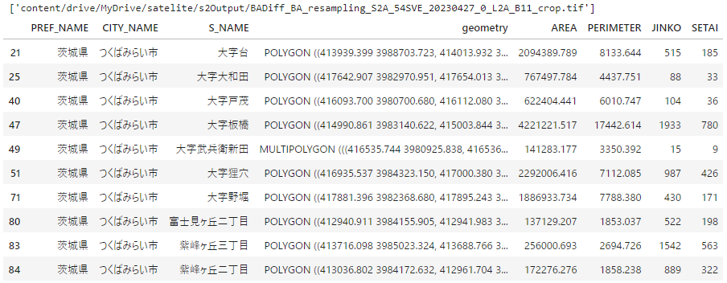  
<br>

可視化する。
```python
# BAの2023年2018年の差分データを可視化
masked_BAdiff = rio.open(os.path.join(s2Output, 'masked_smallArea_BADiff_BA_resampling_S2A_54SVE_20230427_0_L2A_B11_crop.tif'))
bounds = masked_BAdiff.bounds
fig = plt.figure(figsize=(2, 2))
ax = plt.subplot(1,1,1)
img = ax.imshow(masked_BAdiff.read()[0], cmap='coolwarm', extent=[bounds.left, bounds.right, bounds.bottom, bounds.top], vmin=-1, vmax=1.5)
divider = mpl_toolkits.axes_grid1.make_axes_locatable(ax)
cax = divider.append_axes('right', '5%', pad='3%')
cbar = plt.colorbar(img, cax=cax)
cbar.ax.tick_params(labelsize=4)
re_shape_tsukuba_mirai_2RasterCrs_2smallArea.plot(facecolor='none', edgecolor='k', alpha=0.8, ax=ax, linewidth=0.2)
plt.setp(ax.get_xticklabels(), fontsize=4)
plt.setp(ax.get_yticklabels(), fontsize=4)
ax.yaxis.offsetText.set_fontsize(4)
ax.yaxis.set_major_formatter(ptick.ScalarFormatter(useMathText=True))
ax.ticklabel_format(style='sci', axis='y', scilimits=(0,0))
plt.show()
```
太陽光発電パネルが設置された領域が赤くなっていることがわかる。ちなみに中心西側の2か所の小さい赤い部分は太陽光発電パネルではなく、新しい大きな物流倉庫が建ったところだった。
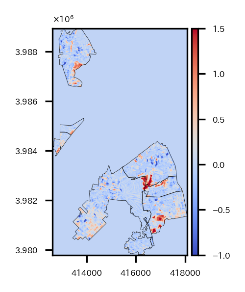  
<br>

同様にcropしてさらにマスクしたRGB画像を作成する。  
実は、ここまでやって気づいたのだが、`rasterio.mask.mask`でcropからmaskまで一気通貫にできるという。引数で`crop=True`とすればいいだけだった。
```python
# バンド2,3,4のデータについてを特定の小地域以外をマスクする
for rio_file4, rio_file3, rio_file2 in zip(B04s, B03s, B02s):
  print(os.path.basename(rio_file4).split('_')[2])
  # ラスターファイルを開く
  with rio.open(rio_file4) as src:
    # ラスターデータをベクターデータで切り抜く
    out_image, out_transform = mask(src, re_shape_tsukuba_mirai_2RasterCrs_2smallArea.geometry, crop=True, nodata=src.nodata)
    out_meta = src.meta
    bounds = src.bounds
    affine = src.transform

  # メタ情報の更新
  out_meta.update({"driver": "GTiff",
                  "height": out_image.shape[1],
                  "width": out_image.shape[2],
                  "transform": out_transform})

  # 画像の書き出し
  with rio.open(os.path.join(os.path.dirname(rio_file4), 'masked_smallArea_'+os.path.basename(rio_file4)), "w", **out_meta) as dest:
    dest.write(out_image)

  # ラスターファイルを開く
  with rio.open(rio_file3) as src:
    # ラスターデータをベクターデータで切り抜く
    out_image, out_transform = mask(src, re_shape_tsukuba_mirai_2RasterCrs_2smallArea.geometry, crop=True, nodata=src.nodata)
    out_meta = src.meta
    bounds = src.bounds
    affine = src.transform

  # メタ情報の更新
  out_meta.update({"driver": "GTiff",
                  "height": out_image.shape[1],
                  "width": out_image.shape[2],
                  "transform": out_transform})

  # 画像の書き出し
  with rio.open(os.path.join(os.path.dirname(rio_file3), 'masked_smallArea_'+os.path.basename(rio_file3)), "w", **out_meta) as dest:
    dest.write(out_image)


  # ラスターファイルを開く
  with rio.open(rio_file2) as src:
    # ラスターデータをベクターデータで切り抜く
    out_image, out_transform = mask(src, re_shape_tsukuba_mirai_2RasterCrs_2smallArea.geometry, crop=True, nodata=src.nodata)
    out_meta = src.meta
    bounds = src.bounds
    affine = src.transform

  # メタ情報の更新
  out_meta.update({"driver": "GTiff",
                  "height": out_image.shape[1],
                  "width": out_image.shape[2],
                  "transform": out_transform})

  # 画像の書き出し
  with rio.open(os.path.join(os.path.dirname(rio_file2), 'masked_smallArea_'+os.path.basename(rio_file2)), "w", **out_meta) as dest:
    dest.write(out_image)
```  
<br>

cropしてさらにマスクしたバンド2,3,4のデータをxarrayとして読み込んでリストに格納。
```python
# バンド2,3,4の小地域のデータ読み込み
B04s_small = sorted(list(glob.glob(os.path.join(s2Output, 'masked_smallArea_*B04_crop*'))), key=lambda x:(x.split('_54SVE_')[-1]))
B03s_small = sorted(list(glob.glob(os.path.join(s2Output, 'masked_smallArea_*B03_crop*'))), key=lambda x:(x.split('_54SVE_')[-1]))
B02s_small = sorted(list(glob.glob(os.path.join(s2Output, 'masked_smallArea_*B02_crop*'))), key=lambda x:(x.split('_54SVE_')[-1]))
# xarrayとして読み込んでリストに格納
allBands2 = []
for i, aband in enumerate([B02s_small[-1], B03s_small[-1], B04s_small[-1]]):
    allBands2.append(rxr.open_rasterio(aband, masked=True).squeeze())
    # バンド数を新しいxarrayオブジェクトとして割り当てる
    allBands2[i]["band"]=i+2

allBands2_2 = []
for i, aband in enumerate([B02s_small[0], B03s_small[0], B04s_small[0]]):
    allBands2_2.append(rxr.open_rasterio(aband, masked=True).squeeze())
    # バンド数を新しいxarrayオブジェクトとして割り当てる
    allBands2_2[i]["band"]=i+2
print(allBands2_2)
```
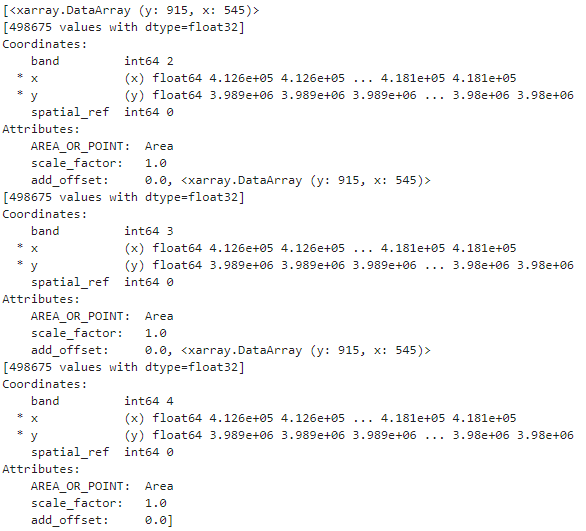  
<br>

RGB画像にクラスタ6のcoutourも重ねたいので、クラスタリング結果のtifも小地域にマスクして保存する。
```python
# クラスタリング結果を小地域にマスクしたtifを作成する
masked_cluster_2023_2018 = rio.open(os.path.join(s2Output, 'masked_cluster_2023_2018.tif'))
out_image, out_transform = mask(masked_cluster_2023_2018, re_shape_tsukuba_mirai_2RasterCrs_2smallArea.geometry, crop=True, nodata=masked_cluster_2023_2018.nodata)
out_meta = masked_cluster_2023_2018.meta
bounds = masked_cluster_2023_2018.bounds
affine = masked_cluster_2023_2018.transform

# メタ情報の更新
out_meta.update({"driver": "GTiff",
                 "height": out_image.shape[1],
                 "width": out_image.shape[2],
                 "transform": out_transform})

# 画像の書き出し
with rio.open(os.path.join(os.path.dirname(masked_cluster_2023_2018.name), 'masked_smallArea_'+os.path.basename(masked_cluster_2023_2018.name)), "w", **out_meta) as dest:
    dest.write(out_image)
```  
<br>

準備が整ったので、可視化する。  
BAの差分のプロット、クラスタリングの結果のプロット、2018年のRGB画像、2023年のRGB画像の4つの図を出力する。
```python
# 特定の小地域のクラスタ6の領域を可視化する

fig = plt.figure(figsize=(12,5))
# 可視化範囲
src = rio.open(B04s_small[-1])
bounds = src.bounds
extent = rio.plot.plotting_extent(src, src.profile["transform"])

# BA差分可視化
masked_BAdiff = rio.open(os.path.join(s2Output, 'masked_smallArea_BADiff_BA_resampling_S2A_54SVE_20230427_0_L2A_B11_crop.tif'))
ax = plt.subplot(1,4,1)
img = ax.imshow(masked_BAdiff.read()[0], cmap='coolwarm', extent=extent, vmin=-1, vmax=1.5)
divider = mpl_toolkits.axes_grid1.make_axes_locatable(ax)
cax = divider.append_axes('right', '5%', pad='3%')
cbar = plt.colorbar(img, cax=cax)
cbar.ax.tick_params(labelsize=4)
re_shape_tsukuba_mirai_2RasterCrs_2smallArea.plot(facecolor='none', edgecolor='k', alpha=0.8, ax=ax, linewidth=0.4)
plt.setp(ax.get_xticklabels(), fontsize=4)
plt.setp(ax.get_yticklabels(), fontsize=4)
ax.yaxis.offsetText.set_fontsize(4)
ax.yaxis.set_major_formatter(ptick.ScalarFormatter(useMathText=True))
ax.ticklabel_format(style='sci', axis='y', scilimits=(0,0))
ax.set_title("BA(NDBI - NDVI):difference between 2023 and 2018", fontsize=4, y=1.0, pad=10)

# 特定の小地域のクラスタを可視化
# クラスタリングデータ
masked_smallArea_masked_cluster_2023_2018 = rio.open(os.path.join(os.path.dirname(masked_cluster_2023_2018.name), 'masked_smallArea_'+os.path.basename(masked_cluster_2023_2018.name)))
ax = plt.subplot(1,4,2)
retted = show(masked_smallArea_masked_cluster_2023_2018, ax=ax, cmap='Dark2_r')
img = retted.images[0]
divider = mpl_toolkits.axes_grid1.make_axes_locatable(ax)
cax = divider.append_axes('right', '5%', pad='3%')
cbar = plt.colorbar(img, cax=cax)
cbar.ax.tick_params(labelsize=4)
re_shape_tsukuba_mirai_2RasterCrs_2smallArea.plot(facecolor='none', edgecolor='k', alpha=0.8, ax=ax, linewidth=0.4)
plt.setp(ax.get_xticklabels(), fontsize=4)
plt.setp(ax.get_yticklabels(), fontsize=4)
ax.yaxis.offsetText.set_fontsize(4)
ax.yaxis.set_major_formatter(ptick.ScalarFormatter(useMathText=True))
ax.ticklabel_format(style='sci', axis='y', scilimits=(0,0))
ax.set_title("BA(NDBI - NDVI):difference between 2023 and 2018 (Clustering)", fontsize=4, y=1.0, pad=10)

# 2018年クラスタ6可視化
ax = plt.subplot(1,4,3)
# バンド2,3,4のデータリストを一つのxarrayオブジェクトへ変換
rgb_arr = xr.concat(allBands2_2, dim="band")
# RGB plot
ep.plot_rgb(rgb_arr.values,
            rgb=[2, 1, 0],
            ax = ax, stretch='hist', str_clip = 5, extent=extent)
# 区画
re_shape_tsukuba_mirai_2RasterCrs_2smallArea.plot(facecolor='none', edgecolor='k', alpha=0.8, ax=ax, linewidth=0.2)

# クラスタ6プロット
arr = masked_smallArea_masked_cluster_2023_2018.read(1)
arr = np.where(arr!=6,-1,arr)  # np.nanにすると表示されない
# ax.imshow(arr, cmap='bwr_r', alpha=0.6, extent=extent)
x = rgb_arr.x.values[::2]  # RGBと分解能が2倍違うので揃えている
y = rgb_arr.y.values[::2]  # RGBと分解能が2倍違うので揃えている
X, Y = np.meshgrid(x, y)
arr2 = masked_smallArea_masked_cluster_2023_2018.read(1)
arr2 = np.where(arr2!=6,-1,arr2)  # np.nanにすると表示されない
contour = ax.contour(X, Y, arr2, [3], colors='k', linewidths=0.8, linestyles='solid', extent=[extent[0],extent[1],extent[3],extent[2]])  # extentのy軸の順番が逆になることに注意(y軸の基準点がimshowと逆)
contour = ax.contour(X, Y, arr2, [3], colors='r', linewidths=0.4, linestyles='solid', extent=[extent[0],extent[1],extent[3],extent[2]])  # extentのy軸の順番が逆になることに注意(y軸の基準点がimshowと逆)
ax.clabel(contour, inline=True, fontsize=3, colors='white')

plt.setp(ax.get_xticklabels(), fontsize=4)
plt.setp(ax.get_yticklabels(), fontsize=4)
ax.yaxis.offsetText.set_fontsize(4)
ax.yaxis.set_major_formatter(ptick.ScalarFormatter(useMathText=True))
ax.ticklabel_format(style='sci', axis='y', scilimits=(0,0))
ax.set_title("Sentinel 2, True Color Image 2018", fontsize=4,)

# 2023年クラスタ6可視化
ax = plt.subplot(1,4,4)
# バンド2,3,4のデータリストを一つのxarrayオブジェクトへ変換
rgb_arr = xr.concat(allBands2, dim="band")
ep.plot_rgb(rgb_arr.values,
            rgb=[2, 1, 0],
            ax = ax, stretch='hist', str_clip = 5, extent=extent)
# 区画
re_shape_tsukuba_mirai_2RasterCrs_2smallArea.plot(facecolor='none', edgecolor='k', alpha=0.8, ax=ax, linewidth=0.2)

# クラスタ6プロット
contour = ax.contour(X, Y, arr2, [3], colors='k', linewidths=0.6, linestyles='solid', extent=[extent[0],extent[1],extent[3],extent[2]])  # extentのy軸の順番が逆になることに注意(y軸の基準点がimshowと逆)
contour = ax.contour(X, Y, arr2, [3], colors='r', linewidths=0.4, linestyles='solid', extent=[extent[0],extent[1],extent[3],extent[2]])  # extentのy軸の順番が逆になることに注意(y軸の基準点がimshowと逆)
ax.clabel(contour, inline=True, fontsize=3, colors='white')

plt.setp(ax.get_xticklabels(), fontsize=4)
plt.setp(ax.get_yticklabels(), fontsize=4)
ax.yaxis.offsetText.set_fontsize(4)
ax.yaxis.set_major_formatter(ptick.ScalarFormatter(useMathText=True))
ax.ticklabel_format(style='sci', axis='y', scilimits=(0,0))
ax.set_title("Sentinel 2, True Color Image 2023", fontsize=4,)
plt.show()
```
特定の小地域に絞って見ていると、RGB画像で2018年には緑だったところが、2023年には白くなっており確かに太陽光発電パネルらしきものが設置されたことがわかる。  
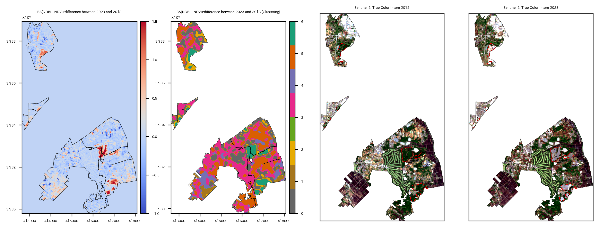

# 特定クラスタ領域の面積計算
クラスタ6は主に太陽光発電パネルが設置された場所ということがわかった。では一体どの程度の広さが変わってしまったのだろうか。クラスタ6とされた領域の面積を求めたい。  

面積を求める方法は2つある。
1. ラスタデータの1ピクセル当たりの面積と領域のピクセル数を掛け合わせる方法
2. ラスタデータをベクターデータに変換して、ポリゴンの面積を求める方法

まず1について。そんなに難しくない。  
分解能は20mなので1ピクセル当たりの面積は$400\mathrm{m^2}$、後はクラスタ6の領域のピクセル数を計算して掛けるだけ。
```python
# クラスタ6のエリアの面積計算（1ピクセル当たりの面積×ピクセル数）
pixel_count = (arr==6).sum()  # ピクセル数
pixel_area = masked_smallArea_masked_cluster_2023_2018.transform[0] * masked_smallArea_masked_cluster_2023_2018.transform[4]  # 1ピクセル当たりの面積
total_area = pixel_count * (pixel_area * -1)
print(masked_smallArea_masked_cluster_2023_2018.crs)
print('Cluster 6 Area:', total_area/1000000, 'km^2')
```
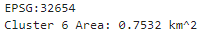  
<br>

2について。`rasterio.features.shapes`を使うと、簡単にベクターデータに変換できる。`rasterio.features.shapes`で作られたオブジェクトから`shapely.geometry.shape`を使ってPOLYGONを計算できるので、GeoDataFrame化して面積を求めるだけでOK。
```python
# クラスタ6のエリアの面積計算（ベクターデータ化して）
# クラスタリングデータ読み込み
masked_smallArea_masked_cluster_2023_2018 = rio.open(os.path.join(os.path.dirname(masked_cluster_2023_2018.name), 'masked_smallArea_'+os.path.basename(masked_cluster_2023_2018.name)))
print('CRS', masked_smallArea_masked_cluster_2023_2018.crs)
arr = masked_smallArea_masked_cluster_2023_2018.read(1)
# クラスタ6以外マスク
#arr = np.where(arr!=13,np.nan,arr)
arr = np.ma.masked_where((arr != 6), arr)  # np.ma.masked_whereじゃないとダメ。np.whereはダメ。
# ベクターデータ化
shapes_gen = shapes(arr, transform=masked_smallArea_masked_cluster_2023_2018.transform)
gdf = gpd.GeoDataFrame({'geometry': [shape(s) for s, v in shapes_gen]})
# 面積
gdf['area'] = gdf['geometry'].area
display(gdf.tail(5))

fig = plt.figure(figsize=(1,2))
ax = plt.subplot(1,1,1)
gdf.plot(facecolor='darkgrey', edgecolor='k', alpha=0.8, ax=ax, linewidth=0.4)
plt.setp(ax.get_xticklabels(), fontsize=3)
plt.setp(ax.get_yticklabels(), fontsize=3)
ax.yaxis.offsetText.set_fontsize(3)
ax.yaxis.set_major_formatter(ptick.ScalarFormatter(useMathText=True))
ax.ticklabel_format(style='sci', axis='y', scilimits=(0,0))
plt.show()

gdf = gdf.set_crs('EPSG:32654')  # allow_override=True
print(gdf.crs)
print('Cluster 6 Area:', gdf['area'].sum()/1000000, 'km^2')
```
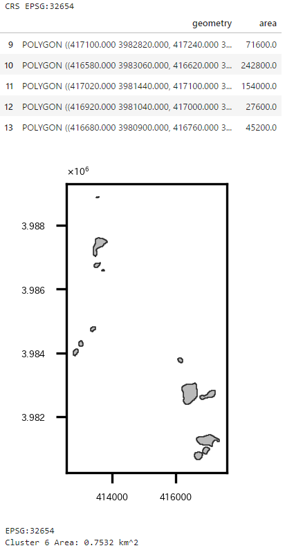  
<br>

1の手法、2の手法どちらも同じ値$0.75\mathrm{km^2}$になった。  
ただクラスタリングはなましたデータを使ったので、実際の面積よりは大きく計算されているとは思う。でもある程度良い推定にはなっているのではないだろうか。  

ちなみにつくばみらい市全体の面積は以下の通り。（もともとの座標系でも出してみた。）
```python
# つくばみらい市の面積(EPSG:6677)
print(part_in_shape.crs)
print('All Area in Tsukubamirai:', round(part_in_shape.area.sum()/1000000,2), 'km^2')

# つくばみらい市の面積(EPSG:32654)
print(part_in_shape.to_crs('EPSG:32654').crs)
print('All Area in Tsukubamirai:', round(part_in_shape.to_crs('EPSG:32654').area.sum()/1000000,2), 'km^2')
```
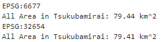  
<br>

[市のホームページ](https://www.city.tsukubamirai.lg.jp/page/page002206.html)によると、$79.16 \mathrm{km^2}$だったのでほぼ合っている。けど完全には一致しないんだな…。

# ベクターデータ化してモランI統計量計算
これまでと話は変わって、空間統計解析を実施する。  
以前書いた記事["「Rではじめる地理空間データの統計解析入門」を衛星データを使って実践"](https://qiita.com/chicken_data_analyst/items/6a8a6491fd0c4d12e665)でも実施したのだが、ラスタデータをベクターデータに変換して、モランI統計量を求めるということをやる。  

これまでの作業で作られた2023年のNDBIのデータを使う。  
ベクターデータへの変換は`rasterstats`パッケージを使って実施する。`rasterstats.zonal_stats`を使うとラスタデータのポリゴン内の平均値や最大値などの記述統計量を計算してくれるので、計算結果をgeopandasのデータフレームに追加すれば、簡単にベクターデータ化が完了する。  
ベクターデータ化と可視化まで実施。
```python
# 2023年のNDBIのラスターデータをベクターデータ化する
# ラスタデータを読み込んでプロット
masked_NDBI_resampling_S2A_54SVE_20230427_0_L2A_B11_crop = rio.open(os.path.join(s2Output, 'masked_NDBI_resampling_S2A_54SVE_20230427_0_L2A_B11_crop.tif'))
bounds = masked_NDBI_resampling_S2A_54SVE_20230427_0_L2A_B11_crop.bounds
affine = masked_NDBI_resampling_S2A_54SVE_20230427_0_L2A_B11_crop.transform
fname = os.path.basename(masked_NDBI_resampling_S2A_54SVE_20230427_0_L2A_B11_crop.name)
vals = masked_NDBI_resampling_S2A_54SVE_20230427_0_L2A_B11_crop.read(1)
extent = rio.plot.plotting_extent(masked_NDBI_resampling_S2A_54SVE_20230427_0_L2A_B11_crop, masked_NDBI_resampling_S2A_54SVE_20230427_0_L2A_B11_crop.profile["transform"])
re_shape_tsukuba_mirai_2RasterCrs_NDBI = re_shape_tsukuba_mirai_2RasterCrs.copy()
fig = plt.figure(figsize=(4, 2))
ax = plt.subplot(1,2,1)
img = ax.imshow(vals, cmap='coolwarm', extent=extent, vmin=-0.2, vmax=0.2)
re_shape_tsukuba_mirai_2RasterCrs_NDBI.plot(facecolor='none', edgecolor='k', ax=ax, linewidth=0.2)
divider = mpl_toolkits.axes_grid1.make_axes_locatable(ax)
cax = divider.append_axes('right', '5%', pad='3%')
cbar = plt.colorbar(img, cax=cax)
cbar.ax.tick_params(labelsize=4)
plt.setp(ax.get_xticklabels(), fontsize=4)
plt.setp(ax.get_yticklabels(), fontsize=4)
ax.set_title(fname.split('_')[1]+'_'+fname.split('_')[5], fontsize=4)
ax.yaxis.offsetText.set_fontsize(4)
ax.yaxis.set_major_formatter(ptick.ScalarFormatter(useMathText=True))
ax.ticklabel_format(style='sci', axis='y', scilimits=(0,0))

# ラスタデータの各ピクセルの値について、ポリゴン領域内の平均を取り、ベクターデータ化する
# rasterstats.zonal_statsでポリゴン内のピクセルの値のmin,max,mean,countを計算
mean_stats = rasterstats.zonal_stats(re_shape_tsukuba_mirai_2RasterCrs_NDBI, vals, affine=affine)#, stats='mean')  # rasterstatsパッケージを使用
mean_stats = [m['mean'] for m in mean_stats]  # 平均値を取得
re_shape_tsukuba_mirai_2RasterCrs_NDBI['NDBI'] = mean_stats
ax = plt.subplot(1,2,2)
divider = mpl_toolkits.axes_grid1.make_axes_locatable(ax)
cax = divider.append_axes('right', '5%', pad='3%')
img = re_shape_tsukuba_mirai_2RasterCrs_NDBI.plot(column='NDBI', cmap='coolwarm', edgecolor='k', legend=True, ax=ax, cax=cax, linewidth=0.2, vmin=-0.25, vmax=0.1)#, vmin=-0.5, vmax=0.5
cax.tick_params(labelsize='4')
plt.setp(ax.get_xticklabels(), fontsize=4)
plt.setp(ax.get_yticklabels(), fontsize=4)
ax.set_title(fname.split('_')[1]+'_'+fname.split('_')[5], fontsize=4)
# re_shape_tsukuba_mirai_2RasterCrs_NDBI.plot(facecolor='none', edgecolor='k', alpha=0.8, ax=ax, linewidth=0.2)
ax.yaxis.offsetText.set_fontsize(4)
ax.yaxis.set_major_formatter(ptick.ScalarFormatter(useMathText=True))
ax.ticklabel_format(style='sci', axis='y', scilimits=(0,0))
plt.tight_layout()
plt.show()
```
左ラスタデータ、右ベクターデータに変換（平均値）
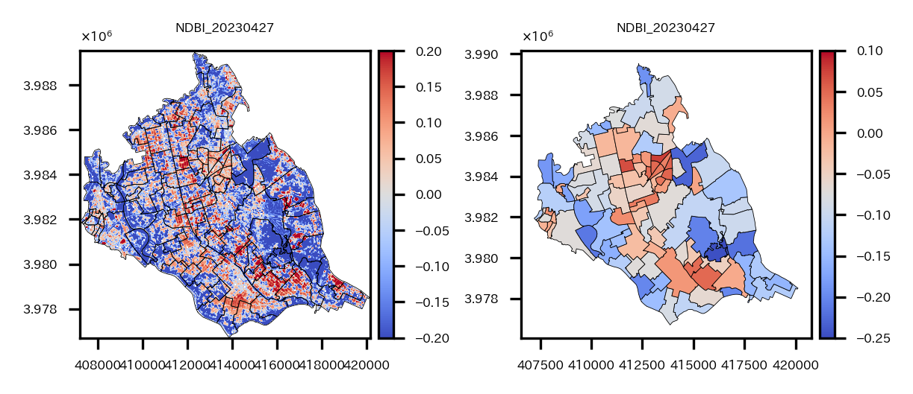
<br>

ベクターデータに変換できたら、モランI統計量などを求められる。

空間統計の説明は __「[Rではじめる地理空間データの統計解析入門](https://www.kspub.co.jp/book/detail/5273036.html)」から引用__ していく。
## 空間相関と近接行列
### 空間相関
空間データの基本的な性質の一つに、「近所と相関関係を持つ」という空間相関がある。
空間相関には近所と似た傾向を持つという正の空間相関と、近所と逆の傾向を持つ負の空間相関がある。
空間データには多くの場合正の相関がある(駅に近いほど地価が高い、工場に近いほど地価が低いなど)。一方、負の相関は空間競争の結果として現れると言われている(大型ショッピングモールができると周辺の商店の売り上げが下がるなど)。


### 近所の定義
空間相関をモデル化するためには、近所を定義する必要がある。
近所の定義は例えば以下のようなものがある。
- 境界を共有するゾーン(ルーク型; 縦横)
- 境界または点を共有するゾーン(クイーン型; 縦横斜め)
- 最近隣kゾーン
- 一定距離以内のゾーン

今回は最近隣kゾーンを定義とする。
これは、例えば各ゾーンに地理的重心(役所とか代表点の位置座標)があるとすると、自分自身を含まない地理的重心間距離の近隣4ゾーン(k=4)を近所とする、というような定義である。


### 近接行列
このように近所を定義したとして、それをデータとしてはどう表すかというと、近接行列を使う。
ゾーン$i$と$j$の近さ$ω_{i,j}$を第$(i,j)$要素を持つ行列を近接行列と呼ぶ。
東京、神奈川、埼玉、千葉の4都県の近接性を上下左右(ルーク型)と定義すると近接行列は以下のようになる。

同一ゾーン内の空間相関は考慮しないこととするので、対角要素は0になる。

近接行列は行基準化されることもあるので、その時は以下のような近接行列になる。


今回のベクターデータで最近隣4ゾーンを近隣とした近接行列を視覚化してみると以下のようになる。
```python
# 最近隣4ゾーンの計算して可視化する
# 重心（中心点）の計算
coords = re_shape_tsukuba_mirai_2RasterCrs.centroid.map(lambda geom: (geom.x, geom.y)).tolist()
kd = libpysal.cg.KDTree(np.array(coords))
# 最近隣4ゾーンの計算
wnn2 = libpysal.weights.KNN(kd, 4)
# GeoDataFrameのプロット
fig = plt.figure(figsize=(2, 2))
ax = plt.subplot(1,1,1)
re_shape_tsukuba_mirai_2RasterCrs.plot(facecolor='none', edgecolor='k', ax=ax, linewidth=0.2)
plt.setp(ax.get_xticklabels(), fontsize=4)
plt.setp(ax.get_yticklabels(), fontsize=4)
ax.set_title(fname.split('_')[5], fontsize=4)
ax.yaxis.offsetText.set_fontsize(4)
ax.yaxis.set_major_formatter(ptick.ScalarFormatter(useMathText=True))
ax.ticklabel_format(style='sci', axis='y', scilimits=(0,0))

# 近接行列のプロット
for i, (key, val) in enumerate(wnn2.neighbors.items()):
    for neighbor in val:
        ax.plot([coords[i][0], coords[neighbor][0]], [coords[i][1], coords[neighbor][1]], color='red', linewidth=0.2, marker='o', markersize=0.5, markerfacecolor="k", markeredgecolor="k")

plt.show()
```
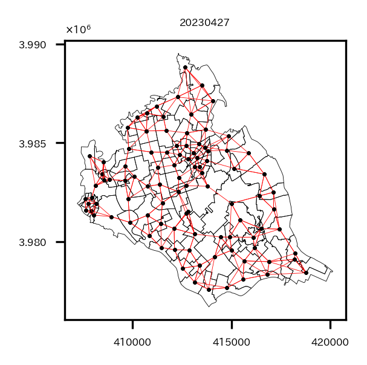

わかりにくいが、各小地域の地理的重心から4本の線が出ている。この線でつながっているほかの小地域が近隣小地域ということになる。
このように近所を定義することによって空間相関を評価することができる。

## 大域空間統計量
空間相関の評価には、標本全体に対する空間相関の強さを評価する __大域空間統計量__ とゾーンごとの局所的な空間相関の強さを評価する __局所空間統計量__ がある。
まずは大域空間統計量から見ていく。
### モランI統計量
モラン$I$統計量はN個のゾーンで区切られたデータ$y_1, …, y_N$の空間相関を評価する指標。
$$
I=\frac{N}{\sum_{i}\sum_{j}ω_{ij}}\frac{\sum_{i}\sum_{j}ω_{ij}(y_{j}-\bar{y})(y_{i}-\bar{y})}{\sum_{i}(y_{i}-\bar{y})^2}
$$
$\bar{y}$は標本平均。$ω_{i,j}$は近接行列の第$(i,j)$要素であり、ゾーン$i$と$j$の近さを表す既知の重み。
自ゾーン$(y_{i}-\bar{y})$と近隣$(\sum_{j}ω_{ij}(y_{j}-\bar{y}))$との相関の強さを表す指標となる。
$I$が正の方向に大きいと正の相関、負の方向に大きいと負の相関があることを意味する。

近接行列を定義して、NDBIの大域的な空間相関を調べてみる。
```python
# 実際に近接行列を求め、4近傍との統計量を出す
# 近接行列計算
spatial_weight_matrix = weights.KNN.from_dataframe(df=re_shape_tsukuba_mirai_2RasterCrs_NDBI, k=4)

# 大域モランI統計量計算
moran_i_obj = esda.moran.Moran(y=re_shape_tsukuba_mirai_2RasterCrs_NDBI['NDBI'], w=spatial_weight_matrix)
print('Moran I:', moran_i_obj.I, '\np-value:', moran_i_obj.p_sim)
```
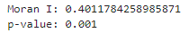
<br>

$I$は0.40となっており、空間相関の検定でp値が0.001となっているので、NDBIは空間相関があるといえる。  

## 局所空間統計量
局所空間統計量(LISA)は各ゾーン周辺の局所的な空間特性を評価するための統計量。
大域所空間統計量(GISA)とは以下の関係がある。
$$
GISA=\frac{1}{N}\sum_{i=1}^N{LISA_i}
$$
つまり大域空間統計量をゾーンごとに分解したものが局所空間統計量である。
なので今回の場合は小地域ごとに局所空間統計量が求められるので、プロットすることでどの小地域に正の相関がありそうか、などを分析することが可能になる。
ということで局所モラン$I$統計量を求めてみる。
### 局所モランI統計量
$$
I_i=\frac{1}{m}(y_{i}-\bar{y})\sum_{j}ω_{ij}(y_{j}-\bar{y})
$$
$m(=\frac{1}{n-1}\sum_{i=1,i{\neq}j}^{I}(y_{i}-\bar{y})^{2}-\bar{y}^{2})$は、$I$を分解した過程で現れる定数。
$I_i$は自分と周辺の相関に着目した指標で、自分の周辺が似た傾向を持つ(正の空間相関)場合は正、逆の傾向を持つ(負の空間相関)場合は負になる。
局所モラン$I$統計量は`pysal.explore.esda.moran.Moran_Local`ですぐに出せる。  

また、局所モラン$I$統計量については、モラン散布図が出せる。
局所モラン$I$統計量の式から、以下のことが考えられる。
- 自分も周辺も平均以上($I_i$は正)
    - $y_{i}-\bar{y}>0$かつ$\sum_{j}ω_{ij}(y_{j}-\bar{y})>0$
- 自分も周辺も平均以下($I_i$は正)
    - $y_{i}-\bar{y}<0$かつ$\sum_{j}ω_{ij}(y_{j}-\bar{y})<0$
- 自分は平均以上、周辺は平均以下($I_i$は負)
    - $y_{i}-\bar{y}>0$かつ$\sum_{j}ω_{ij}(y_{j}-\bar{y})<0$
- 自分は平均以下、周辺は平均以上($I_i$は負)
    - $y_{i}-\bar{y}<0$かつ$\sum_{j}ω_{ij}(y_{j}-\bar{y})>0$

つまり$y_{i}-\bar{y}$と$\sum_{j}ω_{ij}(y_{j}-\bar{y})$に基づいて4分割できる。
横軸を$y_{i}-\bar{y}$、縦軸を$\sum_{j}ω_{ij}(y_{j}-\bar{y})$として散布図を描くと、周辺に対して突出して高い/低い、周辺も自分も高い/低いゾーンを確認することができる。これをモラン散布図という。
`pysal.viz.splot`の`esda.plot_moran`ですぐにモラン散布図は出せる。  

各小地域の局所モラン$I$統計量と、モラン散布図において4分割したうちのどの象限にいるかの可視化を実施。
```python
# 局所モランI統計量を求め、可視化
local_moran_i_obj = esda.moran.Moran_Local(y=re_shape_tsukuba_mirai_2RasterCrs_NDBI['NDBI'], w=spatial_weight_matrix)
re_shape_tsukuba_mirai_2RasterCrs_NDBI['local_moran'] = local_moran_i_obj.Is  # 局所モランI統計量値
re_shape_tsukuba_mirai_2RasterCrs_NDBI['quadrant'] = local_moran_i_obj.q  # 所属象限
re_shape_tsukuba_mirai_2RasterCrs_NDBI['p_value'] = local_moran_i_obj.p_sim  # p_sim

fig = plt.figure(figsize=(4, 2))
# 局所モランI統計量可視化
ax = plt.subplot(1,2,1)
divider = mpl_toolkits.axes_grid1.make_axes_locatable(ax)
cax = divider.append_axes('right', '5%', pad='3%')
img = re_shape_tsukuba_mirai_2RasterCrs_NDBI.plot(column='local_moran', cmap='RdYlBu_r', edgecolor='k', legend=True, ax=ax, cax=cax,
                                       linewidth=0.2, vmin=-1, vmax=2.5)#, vmin=-0.5, vmax=0.5
cax.tick_params(labelsize='4')
plt.setp(ax.get_xticklabels(), fontsize=4)
plt.setp(ax.get_yticklabels(), fontsize=4)
ax.set_title('local moran', fontsize=4)
ax.yaxis.offsetText.set_fontsize(4)
ax.yaxis.set_major_formatter(ptick.ScalarFormatter(useMathText=True))
ax.ticklabel_format(style='sci', axis='y', scilimits=(0,0))

# 所属象限可視化
ax = plt.subplot(1,2,2)
divider = mpl_toolkits.axes_grid1.make_axes_locatable(ax)
cax = divider.append_axes('right', '5%', pad='3%')
img = re_shape_tsukuba_mirai_2RasterCrs_NDBI.plot(column='quadrant', cmap='Pastel2', edgecolor='k', legend=True, ax=ax, cax=cax, linewidth=0.2)#, vmin=-0.5, vmax=0.5
cax.tick_params(labelsize='4')
plt.setp(ax.get_xticklabels(), fontsize=4)
plt.setp(ax.get_yticklabels(), fontsize=4)
ax.set_title('quadrant', fontsize=4)
ax.yaxis.offsetText.set_fontsize(4)
ax.yaxis.set_major_formatter(ptick.ScalarFormatter(useMathText=True))
ax.ticklabel_format(style='sci', axis='y', scilimits=(0,0))
plt.tight_layout()
plt.show()
```
左が局所モラン$I$統計量、右が象限。  
中心の駅周辺や、中心から南東の地域で局所モラン$I$統計量が大きくなっている。しかし中心の駅周辺は第1象限（自分も周辺も平均以上($I_i$は正)）に属し、中心から南東の地域は第3象限（自分も周辺も平均以下($I_i$は正)）に属しているという違いがある。
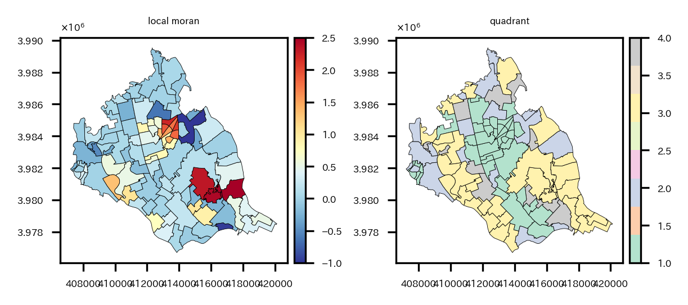
<br>

モラン散布図。
```python
# モラン散布図
plt.rcParams["font.size"] = 4
fig_obj, axes_obj = plot_moran(moran=moran_i_obj, zstandard=True, figsize=(4,2), scatter_kwds={'s':8})
fig_obj.tight_layout()
plt.show()
```
大域のモラン$I$統計量の空間相関の検定でp値が0.001となっているのでNDBIに空間相関があるようだと書いたが、モラン散布図より正の相関があると言えるようだ。まあNDBIのプロット見る感じそりゃそうだって感じだけど。
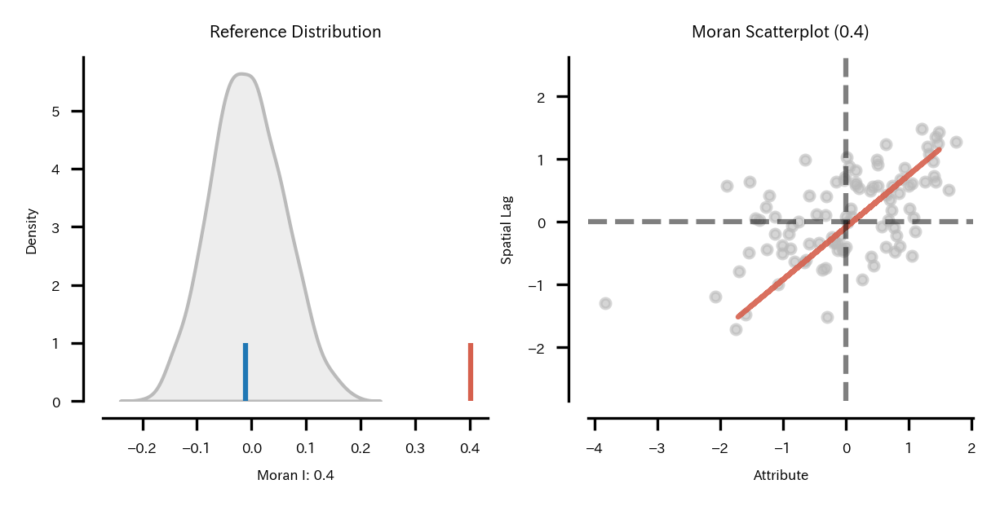
<br>

`pysal.viz.splot`の`esda.plot_local_autocorrelation`では、モラン散布図、LISAクラスタマップ、空間統計量を求めている変数の分布（コロプレスマップ）の3つの図を一気にプロットできる。  
LISAクラスタマップでは各地点でのローカルな空間相関の統計的な有意性を示す地域のみ色付けされる。色は所属象限によって異なるようにプロットされる。
```python
# 地理的なデータのローカル自己相関（local autocorrelation）を可視化
# 各地点でのローカル自己相関の統計的な有意性を示す
# モラン散布図、LISAクラスタマップ、NDBIの分布（コロプレスマップ）をプロット
local_autocorrelation_gdf = re_shape_tsukuba_mirai_2RasterCrs_NDBI[['NDBI', 'geometry']].copy()
fig_obj, axes_obj = plot_local_autocorrelation(local_moran_i_obj, local_autocorrelation_gdf, 'NDBI', 
                                               p=0.05,
                                               scatter_kwds={'s':8},
                                               #quadrant=4,
                                               figsize=(6, 2))
# LISAクラスタマップ凡例の取得&サイズ変更
cax = fig_obj.get_axes()[1]
for i in cax.legend_.legendHandles:
    i.set_markersize(4)
# コロプレスマップ凡例の取得&サイズ変更
cax = fig_obj.get_axes()[2]
for i in cax.legend_.legendHandles:
    i.set_markersize(4)
plt.show()
```
左モラン散布図、中央LISAクラスタマップ、右NDBIのコロプレスマップ。
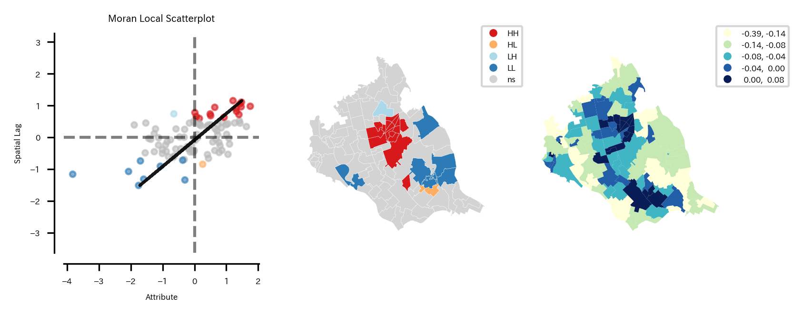  
<br> 

LISAクラスタマップから、
1. つくばみらい市中心の駅周辺は第1象限に属し、正の空間相関があると言える。つまり自分も周りもNDBIが高い地域であると言える。
2. つくばみらい市中心から南東の地域では第3象限に属し、正の空間相関があると言える。つまり自分も周りもNDBIが低い地域であると言える。
3. つくばみらい市中心からやや北の地域では第2象限に属し、正の空間相関があると言える地域がある。これは自分はNDBIが低いが周辺の地域はNDBIが高い地域であると言える。
4. つくばみらい市中心から南東の地域では第4象限に属し、正の空間相関があると言える地域がある。これは自分はNDBIが高いが周辺の地域はNDBIが低い地域であると言える。

3の地域は周辺は森林がある地域なのに、この地域は休耕地なのか何もない土地が多かった。ただ都市化もしていない。
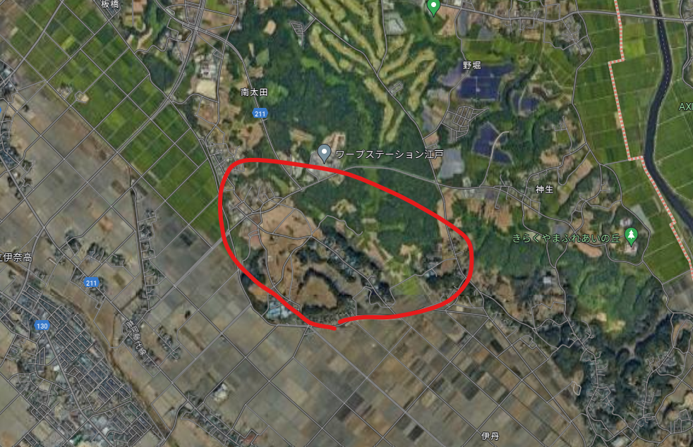  
<br>

4の地域はすぐ南の地域まで住宅街があるが、この地域から森林がある地域になる。
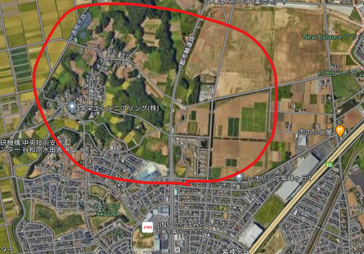  
<br>

このように、空間的な相関から、特殊な地域の周囲と違う地域を見つけることもできる。  

`pysal.viz.splot`の`esda.lisa_cluster`なら、LISAクラスタマップを単独で出すことも可能。
```python
# LISAクラスタマップ可視化
lisa_cluster_gdf = re_shape_tsukuba_mirai_2RasterCrs_NDBI[['NDBI', 'geometry']].copy()
fig = plt.figure(figsize=(4, 2))
ax = plt.subplot(1,2,1)
divider = mpl_toolkits.axes_grid1.make_axes_locatable(ax)
fig_obj, axes_obj = splot.esda.lisa_cluster(local_moran_i_obj, lisa_cluster_gdf, ax=ax)
# LISAクラスタマップ凡例の取得&サイズ変更
cax = fig_obj.get_axes()[0]
for i in cax.legend_.legendHandles:
    i.set_markersize(4)
plt.setp(ax.get_xticklabels(), fontsize=4)
plt.setp(ax.get_yticklabels(), fontsize=4)
ax.set_title('local moran, statistically significant', fontsize=4)
ax.yaxis.offsetText.set_fontsize(4)
ax.yaxis.set_major_formatter(ptick.ScalarFormatter(useMathText=True))
ax.ticklabel_format(style='sci', axis='y', scilimits=(0,0))
plt.show()
```
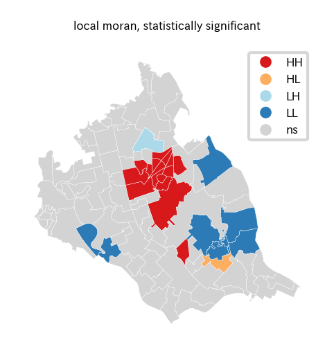  
<br>

※p値のプロットと、有意な相関がある地域に色を付けるプロット
```python
# 局所モランI統計量の有意な領域を可視化
re_shape_tsukuba_mirai_2RasterCrs_NDBI['significant'] = re_shape_tsukuba_mirai_2RasterCrs_NDBI['p_value']<0.05
fig = plt.figure(figsize=(4, 2))
ax = plt.subplot(1,2,1)
divider = mpl_toolkits.axes_grid1.make_axes_locatable(ax)
cax = divider.append_axes('right', '5%', pad='3%')
# ブレークポイントとカラーマップの設定
breaks = [0, 0.01, 0.05, 0.10, 1]
nc = len(breaks) - 1
cmap = get_cmap("Oranges_r", nc)
norm = BoundaryNorm(breaks, cmap.N)
img = re_shape_tsukuba_mirai_2RasterCrs_NDBI.plot(column='p_value', cmap=cmap, edgecolor='k', legend=True, ax=ax, cax=cax,
                                       linewidth=0.2, vmin=0, vmax=1, norm=norm)
plt.setp(ax.get_xticklabels(), fontsize=4)
plt.setp(ax.get_yticklabels(), fontsize=4)
ax.set_title('local moran, p_value', fontsize=4)
ax.yaxis.offsetText.set_fontsize(4)
ax.yaxis.set_major_formatter(ptick.ScalarFormatter(useMathText=True))
ax.ticklabel_format(style='sci', axis='y', scilimits=(0,0))
cax.tick_params(labelsize='4')

ax = plt.subplot(1,2,2)
divider = mpl_toolkits.axes_grid1.make_axes_locatable(ax)
img = re_shape_tsukuba_mirai_2RasterCrs_NDBI.plot(column='significant', cmap='Purples', edgecolor='k', legend=True, ax=ax,
                                       linewidth=0.2, vmin=-0.1, vmax=1.5)
plt.setp(ax.get_xticklabels(), fontsize=4)
plt.setp(ax.get_yticklabels(), fontsize=4)
ax.set_title('local moran, statistically significant (0.05)', fontsize=4)
ax.yaxis.offsetText.set_fontsize(4)
ax.yaxis.set_major_formatter(ptick.ScalarFormatter(useMathText=True))
ax.ticklabel_format(style='sci', axis='y', scilimits=(0,0))
# 有意な領域マップ凡例の取得&サイズ変更
cax = fig.get_axes()[-1]
for i in cax.legend_.legendHandles:
    i.set_markersize(4)
plt.tight_layout()
plt.show()
```
左p値のプロット、右p値<0.05の地域に色を付けたプロット
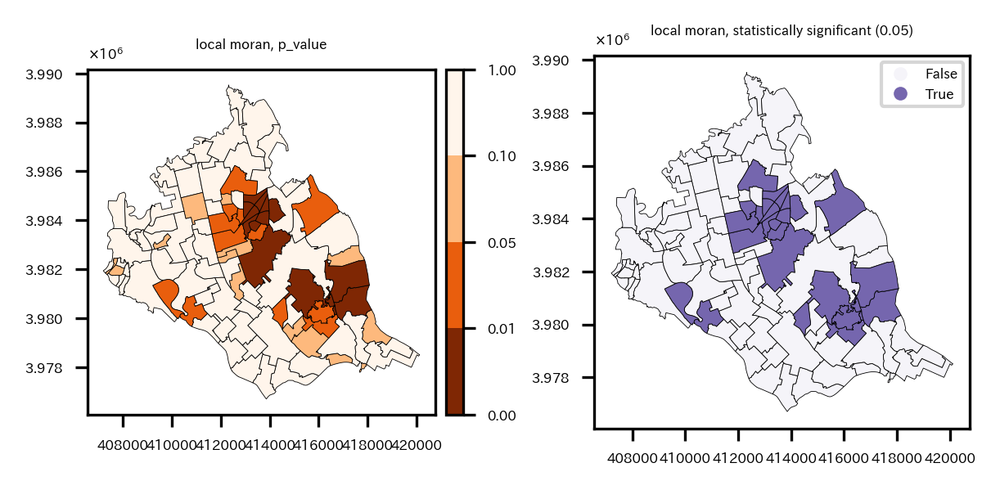

# おわりに
さて、いろいろやってきたが、再度まとめると以下の事を実施した。
1. 衛星データダウンロード
2. 小地域の境界データダウンロード
3. 衛星データの前処理
4. バンド演算
5. クラスタリング
6. 特定クラスタ領域の面積計算
7. ベクターデータ化してモランI統計量計算

地理空間データやっぱり面白いな。以前はRでやったが、Pythonでも全然できる。  
ラスタデータを扱うにはベクターデータも扱えないといけないので、今回のように課題設定して特定の地域を切り取って分析を試しにしてみると、データハンドリングのスキルがかなり身につくような気がする。  
今後は機械学習を使った空間予測とかそのあたりの勉強をしようかな。  
本当に神本だった。（[「Pythonで学ぶ衛星データ解析基礎 環境変化を定量的に把握しよう」](https://gihyo.jp/book/2022/978-4-297-13232-3)）  

以上！